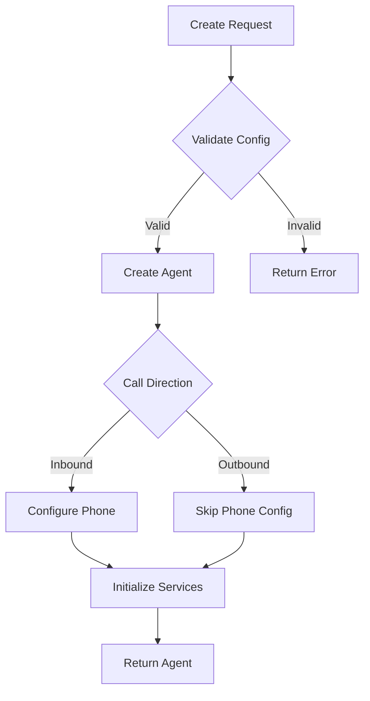

# Create Agent

Create a new AI voice agent with customized configuration for handling calls. The agent can be configured for either inbound or outbound calling with specific conversation behaviors.

## Authentication

Include your API key in the request headers:

```bash
Authorization: Bearer YOUR_API_KEY
```

## Request Body

<ParamField body="agent_config" type="object" required>
  Configuration details for the agent.

  <Expandable title="agent_config properties">
    <ParamField body="agent_name" type="string" required>
      Name of the agent (e.g., "Sales Representative")
    </ParamField>

    <ParamField body="agent_type" type="string" required>
      Type of the agent (sales, support, appointment, survey, custom)
    </ParamField>

    <ParamField body="call_direction" type="string" required>
      Direction of calls - either "inbound" or "outbound"
    </ParamField>

    <ParamField body="inbound_phone_number" type="string">
      Required if call_direction is "inbound". The phone number in E.164 format
    </ParamField>

    <ParamField body="timezone" type="string" default="America/Los_Angeles">
      Timezone for the agent's operations
    </ParamField>

    <ParamField body="country" type="string" default="US">
      Country code for localization settings
    </ParamField>

    <ParamField body="agent_welcome_message" type="string" required>
      Initial message the agent will use to greet callers
    </ParamField>

    <ParamField body="tasks" type="array" required>
      Array of task configurations for the agent

      <Expandable title="task properties">
        <ParamField body="task_type" type="string" required>
          Type of task (e.g., "conversation")
        </ParamField>

        <ParamField body="toolchain" type="object" required>
          Configuration for processing pipeline
        </ParamField>

        <ParamField body="tools_config" type="object" required>
          Configuration for input, output, LLM, transcription, and synthesis
        </ParamField>
      </Expandable>
    </ParamField>
  </Expandable>
</ParamField>

<ParamField body="agent_prompts" type="object" required>
  Dictionary of prompts for each task.

  <Expandable title="agent_prompts properties">
    <ParamField body="task_1" type="object" required>
      Configuration for the first task
      
      <Expandable title="task_1 properties">
        <ParamField body="system_prompt" type="string" required>
          System prompt that supports variable interpolation using \{\{variable.path\}\} syntax
        </ParamField>
      </Expandable>
    </ParamField>
  </Expandable>
</ParamField>

### Example Request

```bash
curl --request POST \
  --url https://api.kallabot.com/v1/agent \
  --header 'Authorization: Bearer YOUR_API_KEY' \
  --header 'Content-Type: application/json' \
  --data '{
    "agent_config": {
      "agent_name": "Sales Representative",
      "agent_type": "sales",
      "call_direction": "outbound",
      "timezone": "America/Los_Angeles",
      "country": "US",
      "agent_welcome_message": "Hello, this is Sarah from Acme Corp",
      "tasks": [
        {
          "task_type": "conversation",
          "toolchain": {
            "execution": "parallel",
            "pipelines": [["transcriber", "llm", "synthesizer"]]
          },
          "tools_config": {
            "input": {"format": "pcm", "provider": "twilio"},
            "output": {"format": "pcm", "provider": "twilio"},
            "llm_agent": {
              "agent_type": "simple_llm_agent",
              "agent_flow_type": "streaming"
            }
          }
        }
      ]
    },
    "agent_prompts": {
      "task_1": {
        "system_prompt": "You are a sales agent for \{\{company.name\}\} selling \{\{company.product\}\}"
      }
    }
  }'
```

## Response

<ResponseField name="success" type="boolean" required>
  Indicates if the request was successful
</ResponseField>

<ResponseField name="data" type="object" required>
  The response data object

  <Expandable title="data properties">
    <ResponseField name="agent_id" type="string" required>
      The unique identifier for the created agent
    </ResponseField>

    <ResponseField name="state" type="string" required>
      The current state of the agent (created, configuring, ready)
    </ResponseField>

    <ResponseField name="inbound_configured" type="boolean" required>
      Whether inbound calling is configured for this agent
    </ResponseField>

    <ResponseField name="message" type="string" required>
      A message describing the result of the operation
    </ResponseField>
  </Expandable>
</ResponseField>

### Example Response

```json
{
  "success": true,
  "data": {
    "agent_id": "ag_01H1V1J3K4M5N6P7Q8R9S0T1U2",
    "state": "created",
    "inbound_configured": false,
    "message": "Agent created successfully"
  }
}
```

## Effects

When an agent is created:
- A new agent record is created in the database
- Agent configuration is validated
- Voice synthesis settings are initialized
- LLM configurations are set up
- If inbound, phone number is configured
- Initial prompts are stored and processed

## Configuration Flow



## Errors

| Status | Description |
|--------|-------------|
| 400    | Invalid request parameters |
| 401    | Invalid or missing API key |
| 403    | Insufficient permissions |
| 409    | Phone number already in use |
| 429    | Rate limit exceeded |
| 500    | Internal server error |

## Best Practices

1. Test agent configurations in a development environment first
2. Use clear and descriptive agent names
3. Keep welcome messages concise and professional
4. Implement proper error handling for all possible states
5. Configure appropriate fallback responses
6. Test voice synthesis settings before deployment
