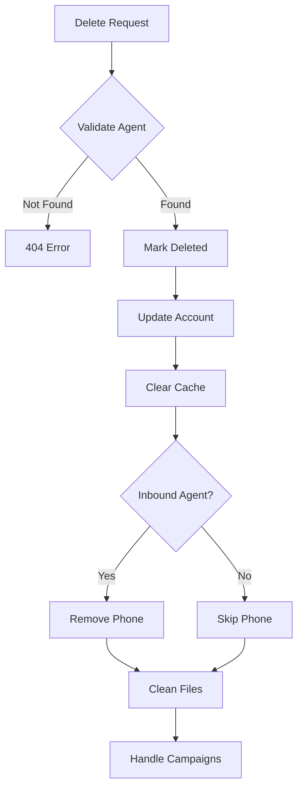

# Delete Agent

Delete an existing AI voice agent and clean up associated resources. This performs a soft delete, preserving historical data while removing the agent from active use.

## Authentication

Include your API key in the request headers:

```bash
Authorization: Bearer YOUR_API_KEY
```

## Path Parameters

<ParamField path="agent_id" type="string" required>
  The unique identifier of the agent to delete
</ParamField>

### Example Request

```bash
curl --request DELETE \
  --url https://api.kallabot.com/v1/agent/ag_01H1V1J3K4M5N6P7Q8R9S0T1U2 \
  --header 'Authorization: Bearer YOUR_API_KEY'
```

## Response

<ResponseField name="status" type="string" required>
  The status of the operation (success)
</ResponseField>

<ResponseField name="message" type="string" required>
  A message describing the result of the operation
</ResponseField>

<ResponseField name="agent_id" type="string" required>
  The ID of the deleted agent
</ResponseField>

### Example Response

```json
{
  "status": "success",
  "message": "Agent deleted successfully",
  "agent_id": "ag_01H1V1J3K4M5N6P7Q8R9S0T1U2"
}
```

## Effects

When an agent is deleted:
- Agent is marked as deleted in the database
- Associated account's agent count is decremented
- Agent data is removed from Redis cache
- Agent's conversation details file is deleted
- If inbound agent, phone number mapping is removed
- Active campaigns using this agent are paused
- Scheduled calls are cancelled

## Cleanup Process



## Validation

Before deletion, the system checks:
- Agent exists
- Agent belongs to account
- No active calls in progress
- User has permission to delete

## Errors

| Status | Description |
|--------|-------------|
| 400    | Invalid agent ID format |
| 401    | Invalid or missing API key |
| 403    | Insufficient permissions |
| 404    | Agent not found |
| 409    | Agent has active calls |
| 500    | Internal server error |

## Best Practices

1. Verify agent ID before deletion
2. Back up important conversation data
3. Notify users of service interruption
4. Update any dependent systems
5. Handle webhook endpoints appropriately
6. Consider using archive instead of delete

## Warning

<Warning>
  While this is a soft delete, it will immediately:
  - Stop all new calls to/from this agent
  - Remove the agent from active campaigns
  - Release any reserved phone numbers
  Make sure this is the intended action before proceeding.
</Warning>

## Related Operations

<Card title="Pause Agent" icon="pause" href="/api-reference/agents/pause">
  Temporarily disable an agent without deletion
</Card>

<Card title="Archive Agent" icon="box-archive" href="/api-reference/agents/archive">
  Archive an agent for future reference
</Card> 