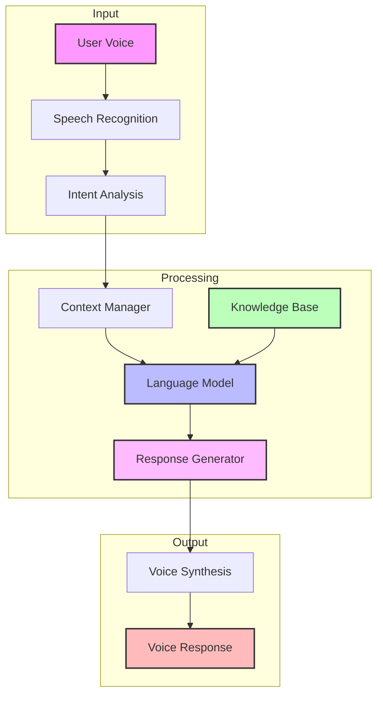

<Note>
  The Agents API enables you to create, manage, and customize AI-powered voice agents that can engage in natural conversations with your customers, leveraging advanced language models and voice synthesis.
</Note>

# Agents Overview

<Frame>
  

    

      Create intelligent voice agents that understand and engage naturally
    

    

      Kallabot's Agents combine state-of-the-art language models, voice synthesis, and conversation management to deliver human-like interactions that adapt to your business needs.
    

  

</Frame>

## Key Features

<CardGroup cols={3}>
  <Card title="Natural Conversations" icon="comments">
    Context-aware dialogue with natural language understanding
  </Card>
  <Card title="Voice Synthesis" icon="waveform">
    High-quality, natural-sounding voice output
  </Card>
  <Card title="Custom Behaviors" icon="sliders">
    Configurable personality and conversation styles
  </Card>
  <Card title="Multi-lingual" icon="language">
    Support for multiple languages and accents
  </Card>
  <Card title="Knowledge Integration" icon="brain-circuit">
    Connect to custom knowledge bases
  </Card>
  <Card title="Analytics" icon="chart-mixed">
    Detailed conversation and performance metrics
  </Card>
</CardGroup>

## Agent Types

<Tabs>
  <Tab title="Inbound">
    

      <CardGroup cols={2}>
        <Card title="Customer Service" icon="headset">
          Handle customer inquiries and support requests
        </Card>
        <Card title="Appointment Scheduling" icon="calendar">
          Manage bookings and appointments
        </Card>
      </CardGroup>
    

  </Tab>
  <Tab title="Outbound">
    

      <CardGroup cols={2}>
        <Card title="Sales" icon="shopping-cart">
          Product presentations and sales calls
        </Card>
        <Card title="Surveys" icon="clipboard-question">
          Conduct market research and feedback collection
        </Card>
      </CardGroup>
    

  </Tab>
</Tabs>

## Agent Architecture

## Available Endpoints

<CardGroup cols={2}>
  <Card title="Create Agent" icon="plus" href="/api-reference/agents/create">
    

      Create new AI voice agents
      <Tabs>
        <Tab title="Method">POST /v1/agent</Tab>
        <Tab title="Features">
          - Personality configuration
          - Voice selection
          - Knowledge integration
        </Tab>
      </Tabs>
    

  </Card>
  <Card title="List Agents" icon="list" href="/api-reference/agents/list">
    

      Retrieve all available agents
      <Tabs>
        <Tab title="Method">GET /v1/agents</Tab>
        <Tab title="Features">
          - Filter by type
          - Status monitoring
          - Usage statistics
        </Tab>
      </Tabs>
    

  </Card>
  <Card title="Update Agent" icon="pen" href="/api-reference/agents/update">
    

      Modify existing agent configuration
      <Tabs>
        <Tab title="Method">PUT /v1/agent/{"{agent_id}"}</Tab>
        <Tab title="Features">
          - Behavior updates
          - Voice changes
          - Knowledge updates
        </Tab>
      </Tabs>
    

  </Card>
  <Card title="Delete Agent" icon="trash" href="/api-reference/agents/delete">
    

      Remove agents and associated resources
      <Tabs>
        <Tab title="Method">DELETE /v1/agent/{"{agent_id}"}</Tab>
        <Tab title="Features">
          - Safe deletion
          - Resource cleanup
          - Usage history
        </Tab>
      </Tabs>
    

  </Card>
</CardGroup>

## Configuration Options

<Tabs>
  <Tab title="Personality">
    <ParamField body="agent_prompts" type="object">
      Personality and behavior configuration
      <Accordion title="Components">
        | Parameter | Description | Example |
        |-----------|-------------|---------|
        | tone | Communication style | Professional, Friendly, Casual |
        | language | Primary language | English, Spanish, French |
        | expertise | Domain knowledge | Technical, Customer Service, Sales |
      </Accordion>
    </ParamField>
  </Tab>
  <Tab title="Voice">
    <ParamField body="voice_config" type="object">
      Voice synthesis settings
      <Accordion title="Options">
        - Voice ID selection
        - Speech rate
        - Pitch adjustment
        - Regional accent
      </Accordion>
    </ParamField>
  </Tab>
  <Tab title="Behavior">
    <ParamField body="behavior_params" type="object">
      Interaction behavior settings
      <Accordion title="Parameters">
        - Response time
        - Interruption handling
        - Turn-taking strategy
        - Error recovery
      </Accordion>
    </ParamField>
  </Tab>
</Tabs>

## Best Practices

<AccordionGroup>
  <Accordion title="Agent Design" icon="paintbrush">
    - Define clear conversation goals
    - Create consistent personality
    - Set appropriate tone
    - Design natural dialogue flows
    - Plan error handling
  </Accordion>

  <Accordion title="Voice Configuration" icon="waveform-lines">
    - Choose appropriate voice
    - Test in target environment
    - Optimize speech parameters
    - Consider audience preferences
    - Plan multilingual support
  </Accordion>

  <Accordion title="Performance Optimization" icon="gauge">
    - Monitor response times
    - Track success rates
    - Analyze conversation flows
    - Optimize prompts
    - Regular testing
  </Accordion>

  <Accordion title="Integration Tips" icon="puzzle-piece">
    - Test thoroughly
    - Monitor interactions
    - Collect feedback
    - Iterate improvements
    - Document customizations
  </Accordion>
</AccordionGroup>

## Limits and Quotas

<CardGroup cols={3}>
  <Card title="Agents" icon="robot">
    

      - Max active: 100
      - Concurrent calls: 50
      - Languages: 10
    

  </Card>
  <Card title="Configuration" icon="sliders">
    

      - Prompt length: 2000
      - Voice options: 20
      - Custom data: 100MB
    

  </Card>
  <Card title="Usage" icon="chart-line">
    

      - Calls/day: 10000
      - Duration: 30min
      - Concurrent: 50
    

  </Card>
</CardGroup>

## Analytics and Monitoring

<Tabs>
  <Tab title="Performance">
    <CardGroup cols={2}>
      <Card title="Response Time" icon="stopwatch">
        Track agent response latency
      </Card>
      <Card title="Success Rate" icon="check">
        Monitor conversation completion
      </Card>
    </CardGroup>
  </Tab>
  <Tab title="Usage">
    <CardGroup cols={2}>
      <Card title="Call Volume" icon="phone">
        Track total calls handled
      </Card>
      <Card title="Duration" icon="clock">
        Monitor conversation length
      </Card>
    </CardGroup>
  </Tab>
</Tabs>

## Error Handling

<ResponseField name="Common Errors" type="object">
  <Expandable title="Error Categories">
    <ResponseField name="configuration" type="object">
      Setup and configuration errors
      <Accordion title="Examples">
        - Invalid prompts
        - Voice not available
        - Invalid parameters
      </Accordion>
    </ResponseField>

    <ResponseField name="runtime" type="object">
      Execution and processing errors
      <Accordion title="Examples">
        - Connection lost
        - Response timeout
        - Resource exhausted
      </Accordion>
    </ResponseField>

    <ResponseField name="integration" type="object">
      Integration and system errors
      <Accordion title="Examples">
        - API errors
        - Service unavailable
        - Rate limited
      </Accordion>
    </ResponseField>
  </Expandable>
</ResponseField>

## Related Resources

<CardGroup cols={2}>
  <Card title="Voice Configuration" icon="microphone" href="/guides/voice-config">
    Voice synthesis setup guide
  </Card>
  <Card title="Prompt Engineering" icon="wand-magic-sparkles" href="/guides/prompts">
    Creating effective agent prompts
  </Card>
  <Card title="Integration Guide" icon="plug" href="/guides/integration">
    System integration patterns
  </Card>
  <Card title="Best Practices" icon="star" href="/guides/agent-best-practices">
    Optimization and management
  </Card>
</CardGroup>

## Support

<CardGroup cols={3}>
  <Card title="Documentation" icon="book">
    Comprehensive guides
  </Card>
  <Card title="API Status" icon="signal" href="https://status.kallabot.com">
    Real-time monitoring
  </Card>
  <Card title="Help Center" icon="headset" href="https://help.kallabot.com">
    24/7 technical support
  </Card>
</CardGroup> 