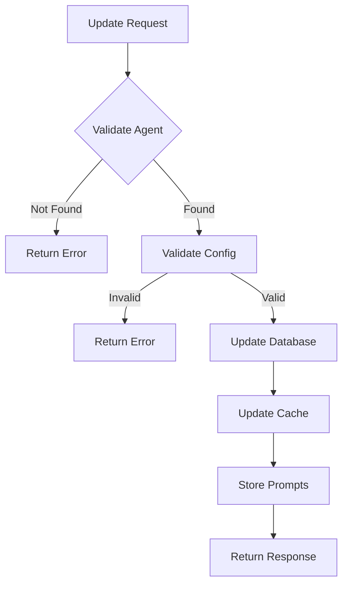

# Update Agent

Update an existing AI voice agent's configuration and prompts. This allows you to modify the agent's behavior, conversation flow, and settings without creating a new agent.

## Authentication

Include your API key in the request headers:

```bash
Authorization: Bearer YOUR_API_KEY
```

## Path Parameters

<ParamField path="agent_id" type="string" required>
  The unique identifier of the agent to update
</ParamField>

## Request Body

<ParamField body="agent_config" type="object" required>
  Updated configuration details for the agent.

  <Expandable title="agent_config properties">
    <ParamField body="agent_name" type="string">
      Name of the agent (e.g., "Sales Representative")
    </ParamField>

    <ParamField body="agent_type" type="string">
      Type of the agent (sales, support, appointment, survey, custom)
    </ParamField>

    <ParamField body="call_direction" type="string">
      Direction of calls - either "inbound" or "outbound"
    </ParamField>

    <ParamField body="inbound_phone_number" type="string">
      Required if call_direction is "inbound". The phone number in E.164 format
    </ParamField>

    <ParamField body="timezone" type="string">
      Timezone for the agent's operations
    </ParamField>

    <ParamField body="country" type="string">
      Country code for localization settings
    </ParamField>

    <ParamField body="agent_welcome_message" type="string">
      Initial message the agent will use to greet callers
    </ParamField>

    <ParamField body="tasks" type="array">
      Array of task configurations for the agent

      <Expandable title="task properties">
        <ParamField body="task_type" type="string">
          Type of task (e.g., "conversation")
        </ParamField>

        <ParamField body="toolchain" type="object">
          Configuration for processing pipeline
        </ParamField>

        <ParamField body="tools_config" type="object">
          Configuration for input, output, LLM, transcription, and synthesis
        </ParamField>
      </Expandable>
    </ParamField>
  </Expandable>
</ParamField>

<ParamField body="agent_prompts" type="object" required>
  Updated dictionary of prompts for each task.

  <Expandable title="agent_prompts properties">
    <ParamField body="task_1" type="object">
      Configuration for the first task
      
      <Expandable title="task_1 properties">
        <ParamField body="system_prompt" type="string">
          System prompt that supports variable interpolation using \{\{variable.path\}\} syntax
        </ParamField>
      </Expandable>
    </ParamField>
  </Expandable>
</ParamField>

### Example Request

```bash
curl --request PUT \
  --url https://api.kallabot.com/v1/agent/ag_01H1V1J3K4M5N6P7Q8R9S0T1U2 \
  --header 'Authorization: Bearer YOUR_API_KEY' \
  --header 'Content-Type: application/json' \
  --data '{
    "agent_config": {
      "agent_name": "Premium Sales Representative",
      "agent_type": "sales",
      "call_direction": "outbound",
      "timezone": "America/New_York",
      "country": "US",
      "agent_welcome_message": "Hello, this is Alex from Acme Corp",
      "tasks": [
        {
          "task_type": "conversation",
          "toolchain": {
            "execution": "parallel",
            "pipelines": [["transcriber", "llm", "synthesizer"]]
          },
          "tools_config": {
            "input": {"format": "pcm", "provider": "twilio"},
            "output": {"format": "pcm", "provider": "twilio"},
            "llm_agent": {
              "agent_type": "simple_llm_agent",
              "agent_flow_type": "streaming"
            }
          }
        }
      ]
    },
    "agent_prompts": {
      "task_1": {
        "system_prompt": "You are a premium sales agent for \{\{company.name\}\} specializing in \{\{company.product\}\}"
      }
    }
  }'
```

## Response

<ResponseField name="status" type="string" required>
  The status of the operation (success)
</ResponseField>

<ResponseField name="message" type="string" required>
  A message describing the result of the operation
</ResponseField>

<ResponseField name="agent_id" type="string" required>
  The ID of the updated agent
</ResponseField>

### Example Response

```json
{
  "status": "success",
  "message": "Agent updated successfully",
  "agent_id": "ag_01H1V1J3K4M5N6P7Q8R9S0T1U2"
}
```

## Update Flow



## Effects

When an agent is updated:
- Agent configuration is validated
- Database record is updated
- Redis cache is refreshed
- Conversation details file is updated
- Active calls continue with previous configuration
- New calls will use updated configuration

## Validation

Before updating, the system checks:
- Agent exists
- Agent belongs to account
- Configuration format is valid
- Required fields are present
- User has permission to update

## Errors

| Status | Description |
|--------|-------------|
| 400    | Invalid request parameters |
| 401    | Invalid or missing API key |
| 403    | Insufficient permissions |
| 404    | Agent not found |
| 409    | Agent is in invalid state for update |
| 500    | Internal server error |

## Best Practices

1. Test configuration changes in development first
2. Update during low-traffic periods
3. Keep previous configuration backed up
4. Validate all prompt variables
5. Monitor agent performance after updates
6. Document configuration changes
7. Update related systems if necessary

## Warning

<Warning>
  - Updates take effect on next call
  - Active calls are not affected
  - Some changes may require agent retraining
  - Backup configurations before major changes
</Warning>

## Related Operations

<Card title="Create Agent" icon="plus" href="/api-reference/agents/create">
  Create a new agent
</Card>

<Card title="Get Agent" icon="circle-info" href="/api-reference/agents/get">
  Get agent details
</Card>

<Card title="Delete Agent" icon="trash" href="/api-reference/agents/delete">
  Delete an agent
</Card>
