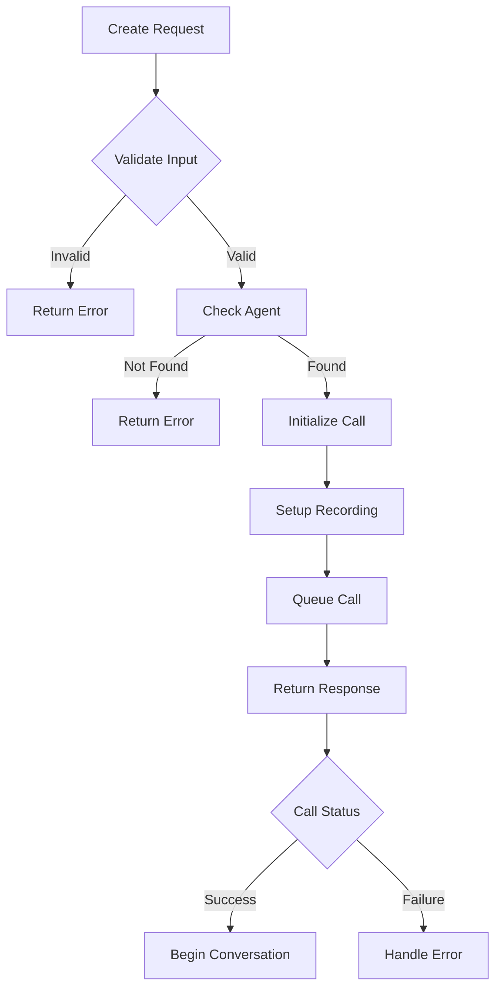

# Create Call

Initiate a new outbound call using a configured AI voice agent. The call will be placed to the specified recipient using the configured agent's voice and conversation settings.

## Authentication

Include your API key in the request headers:

```bash
Authorization: Bearer YOUR_API_KEY
```

## Request Body

<ParamField body="agent_id" type="string" required>
  The unique identifier of the agent that will handle the call
</ParamField>

<ParamField body="recipient_phone_number" type="string" required>
  The phone number to call in E.164 format (e.g., +1234567890)
</ParamField>

<ParamField body="sender_phone_number" type="string" required>
  The phone number to display as the caller ID in E.164 format
</ParamField>

<ParamField body="record" type="boolean" default="false">
  Whether to record the call for quality and training purposes
</ParamField>

<ParamField body="template_variables" type="object">
  Variables to interpolate into the agent's prompts

  <Expandable title="template_variables properties">
    <ParamField body="customer" type="object">
      Customer-specific variables for personalization
    </ParamField>

    <ParamField body="company" type="object">
      Company-specific variables for branding
    </ParamField>

    <ParamField body="context" type="object">
      Additional context variables for the conversation
    </ParamField>
  </Expandable>
</ParamField>

### Example Request

```bash
curl --request POST \
  --url https://api.kallabot.com/v1/call \
  --header 'Authorization: Bearer YOUR_API_KEY' \
  --header 'Content-Type: application/json' \
  --data '{
    "agent_id": "ag_01H1V1J3K4M5N6P7Q8R9S0T1U2",
    "recipient_phone_number": "+1234567890",
    "sender_phone_number": "+1987654321",
    "record": true,
    "template_variables": {
      "customer": {
        "name": "John Smith",
        "account_type": "premium"
      },
      "company": {
        "name": "Acme Corp",
        "product": "Premium Widget"
      },
      "context": {
        "last_interaction": "2023-10-15",
        "previous_purchase": "Basic Widget"
      }
    }
  }'
```

## Response

<ResponseField name="success" type="boolean" required>
  Indicates if the request was successful
</ResponseField>

<ResponseField name="data" type="object" required>
  The response data object

  <Expandable title="data properties">
    <ResponseField name="call_id" type="string" required>
      The unique identifier for the created call
    </ResponseField>

    <ResponseField name="status" type="string" required>
      The current status of the call (queued, ringing, in-progress)
    </ResponseField>

    <ResponseField name="agent_id" type="string" required>
      The ID of the agent handling the call
    </ResponseField>

    <ResponseField name="recording_enabled" type="boolean" required>
      Whether call recording is enabled
    </ResponseField>
  </Expandable>
</ResponseField>

### Example Response

```json
{
  "success": true,
  "data": {
    "call_id": "call_01H1V1J3K4M5N6P7Q8R9S0T1U2",
    "status": "queued",
    "agent_id": "ag_01H1V1J3K4M5N6P7Q8R9S0T1U2",
    "recording_enabled": true
  }
}
```

## Call Flow



## Effects

When a call is created:
- Call record is created in the database
- Agent availability is checked
- Recording is configured if enabled
- Call is queued with Twilio
- Template variables are processed
- Webhooks are configured
- Call monitoring is initialized

## Errors

| Status | Description |
|--------|-------------|
| 400    | Invalid request parameters |
| 401    | Invalid or missing API key |
| 403    | Insufficient permissions |
| 404    | Agent not found |
| 409    | Agent is busy or unavailable |
| 429    | Rate limit exceeded |
| 500    | Internal server error |

## Best Practices

1. Validate phone numbers before calling
2. Test with development credentials first
3. Handle all possible call states
4. Implement proper error handling
5. Monitor call quality metrics
6. Use appropriate timeouts
7. Consider time zones when scheduling calls

## Webhooks

The following events will trigger webhooks if configured:
- call.initiated
- call.ringing
- call.answered
- call.completed
- call.failed
- recording.available

## Rate Limits

| Operation | Limit |
|-----------|-------|
| Calls per minute | 60 |
| Concurrent calls | 50 |
| Recording storage | 10GB |

## Warning

<Warning>
  Ensure compliance with:
  - Local calling regulations
  - Recording consent laws
  - Time-of-day restrictions
  - Do-not-call lists
</Warning>
