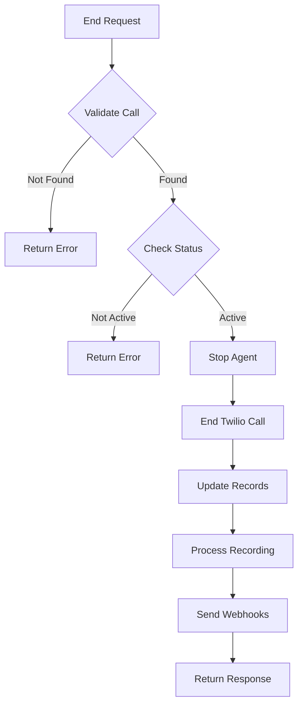

# End Call

Terminate an active call immediately. This will gracefully end the conversation and clean up associated resources.

## Authentication

Include your API key in the request headers:

```bash
Authorization: Bearer YOUR_API_KEY
```

## Path Parameters

<ParamField path="call_id" type="string" required>
  The unique identifier of the call to end
</ParamField>

### Example Request

```bash
curl --request POST \
  --url https://api.kallabot.com/v1/call/call_01H1V1J3K4M5N6P7Q8R9S0T1U2/end \
  --header 'Authorization: Bearer YOUR_API_KEY'
```

## Response

<ResponseField name="success" type="boolean" required>
  Indicates if the request was successful
</ResponseField>

<ResponseField name="data" type="object" required>
  The response data object

  <Expandable title="data properties">
    <ResponseField name="call_id" type="string" required>
      The ID of the ended call
    </ResponseField>

    <ResponseField name="status" type="string" required>
      The final status of the call (completed)
    </ResponseField>

    <ResponseField name="duration" type="integer" required>
      Duration of the call in seconds
    </ResponseField>

    <ResponseField name="recording_url" type="string">
      URL to access the call recording (if recording was enabled)
    </ResponseField>
  </Expandable>
</ResponseField>

### Example Response

```json
{
  "success": true,
  "data": {
    "call_id": "call_01H1V1J3K4M5N6P7Q8R9S0T1U2",
    "status": "completed",
    "duration": 145,
    "recording_url": "https://api.kallabot.com/v1/recordings/rec_01H1V1J3K4M5N6P7Q8R9S0T1U2"
  }
}
```

## Termination Flow



## Effects

When a call is ended:
- Active conversation is terminated
- Agent is released and marked as available
- Call status is updated in the database
- Call duration is calculated and stored
- Recording is finalized (if enabled)
- Webhooks are triggered
- Resources are cleaned up

## Validation

Before ending a call, the system checks:
- Call exists
- Call belongs to account
- Call is currently active
- User has permission to end call

## Errors

| Status | Description |
|--------|-------------|
| 400    | Invalid call ID format |
| 401    | Invalid or missing API key |
| 403    | Insufficient permissions |
| 404    | Call not found |
| 409    | Call already ended |
| 500    | Internal server error |

## Best Practices

1. Verify call ID before ending
2. Implement proper error handling
3. Listen for webhooks to confirm termination
4. Handle recording URLs appropriately
5. Update UI/UX to reflect call status
6. Log termination reasons for analytics

## Webhooks

The following events will trigger webhooks:
- call.ending
- call.ended
- recording.available (if recording was enabled)

## Warning

<Warning>
  - Call termination is immediate and cannot be undone
  - Any ongoing conversation will be stopped
  - Make sure to handle any cleanup in your application
  - Recording processing may continue after call ends
</Warning>

## Related Operations

<Card title="Get Call" icon="circle-info" href="/api-reference/calls/get">
  Get details about a call
</Card>

<Card title="List Calls" icon="list" href="/api-reference/calls/list">
  List all calls
</Card>
