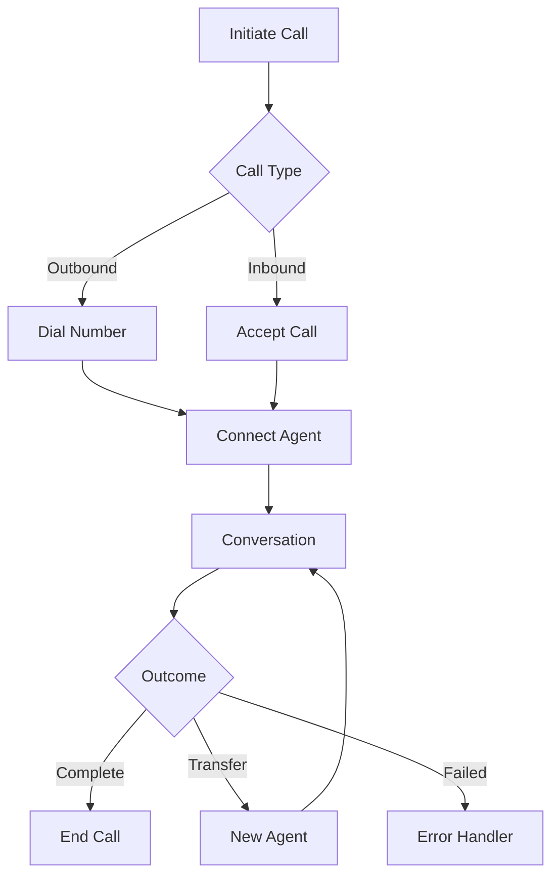

# Calls

The Calls API enables real-time management of voice calls between AI agents and customers, supporting both inbound and outbound communications with advanced control and monitoring capabilities.

## Key Features

### Call Control
- Real-time call initiation and termination
- Dynamic routing and transfer
- Call recording and monitoring
- Quality assurance controls

### Conversation Features
- Real-time transcription
- Sentiment analysis
- Variable injection
- Context preservation

### Analytics
- Call duration tracking
- Success rate monitoring
- Quality metrics
- Performance analytics

## Call States

| State | Description |
|-------|-------------|
| queued | Call is waiting to be initiated |
| ringing | Call is being connected |
| in-progress | Call is actively in conversation |
| completed | Call has finished successfully |
| failed | Call encountered an error |
| no-answer | Call was not answered |
| busy | Recipient was busy |

## Available Endpoints

<Card title="Create Call" icon="plus" href="/api-reference/calls/create">
  Initiate a new outbound call
</Card>

<Card title="List Calls" icon="list" href="/api-reference/calls/list">
  Get a list of all calls
</Card>

<Card title="Get Call" icon="circle-info" href="/api-reference/calls/get">
  Get details of a specific call
</Card>

<Card title="End Call" icon="phone-slash" href="/api-reference/calls/end">
  End an active call
</Card>

## Call Flow

## Best Practices

### Call Management
- Set appropriate timeouts
- Handle all possible call states
- Implement proper error handling
- Monitor call quality

### Recording
- Obtain consent before recording
- Store recordings securely
- Implement retention policies
- Enable easy retrieval

### Performance
- Monitor network conditions
- Track call metrics
- Analyze conversation quality
- Optimize response times

## Rate Limits

| Operation | Limit |
|-----------|-------|
| Concurrent Calls | 50 per account |
| Call Initiations | 60 per minute |
| API Requests | 100 per minute |
| Recording Storage | 10GB per account |

## Webhooks

Kallabot can send real-time updates about call events to your server:

- Call initiated
- Call answered
- Call completed
- Recording available
- Error occurred

## Related Resources

<Card title="Agents" icon="robot" href="/api-reference/agents/overview">
  Learn about AI voice agents
</Card>

<Card title="Campaigns" icon="bullhorn" href="/api-reference/campaigns/overview">
  Manage outbound campaigns
</Card>

<Card title="Analytics" icon="chart-line" href="/api-reference/analytics/overview">
  Access call analytics
</Card> 