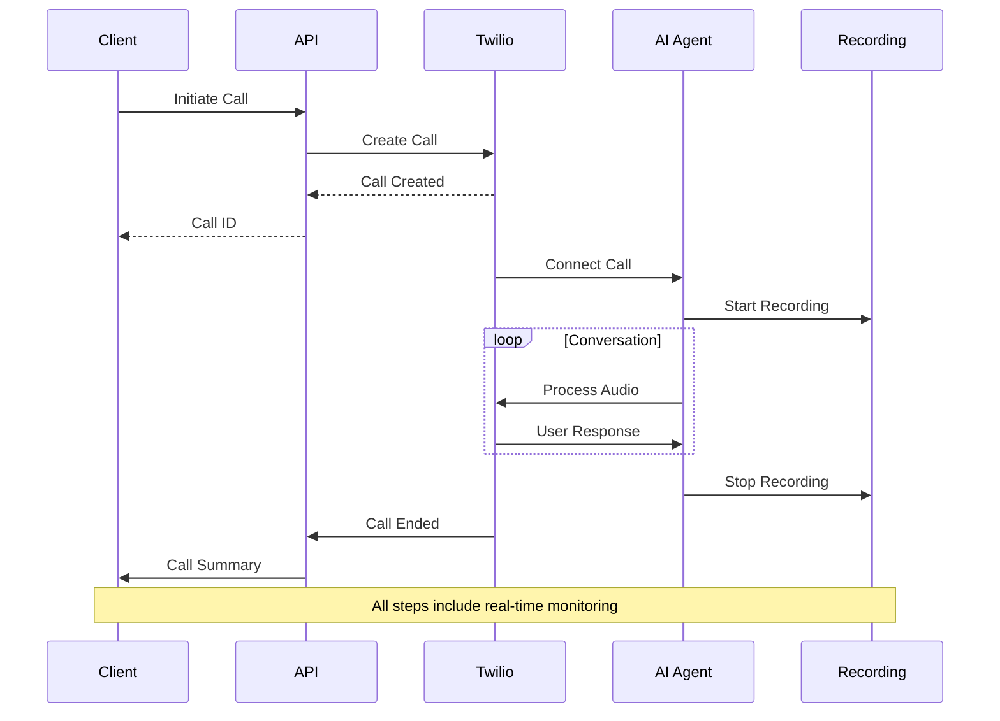

<Note>
  The Calls API enables you to initiate, manage, and monitor voice calls between AI agents and users, providing real-time control and detailed analytics for every interaction.
</Note>

# Calls Overview

<Frame>
  

    

      Manage intelligent voice conversations at scale
    

    

      Kallabot's Calls API provides enterprise-grade voice call management with real-time controls, detailed analytics, and seamless integration with AI agents.
    

  

</Frame>

## Key Features

<CardGroup cols={3}>
  <Card title="Real-time Control" icon="sliders">
    Live call monitoring and management
  </Card>
  <Card title="Call Recording" icon="microphone">
    High-quality audio capture and storage
  </Card>
  <Card title="Analytics" icon="chart-line">
    Detailed metrics and insights
  </Card>
  <Card title="Transcription" icon="file-lines">
    Real-time speech-to-text conversion
  </Card>
  <Card title="Call Routing" icon="route">
    Intelligent call distribution
  </Card>
  <Card title="Quality Monitoring" icon="wave-pulse">
    Voice quality and latency tracking
  </Card>
</CardGroup>

## Call Types

<Tabs>
  <Tab title="Inbound">
    

      <CardGroup cols={2}>
        <Card title="Direct Calls" icon="phone-arrow-down-left">
          Handle incoming customer calls
          <Accordion title="Features">
            - Queue management
            - Priority routing
            - Fallback handling
          </Accordion>
        </Card>
        <Card title="Transferred Calls" icon="arrow-right-arrow-left">
          Process call transfers
          <Accordion title="Features">
            - Context preservation
            - Warm transfer
            - Queue priority
          </Accordion>
        </Card>
      </CardGroup>
    

  </Tab>
  <Tab title="Outbound">
    

      <CardGroup cols={2}>
        <Card title="Campaign Calls" icon="bullhorn">
          Automated outreach campaigns
          <Accordion title="Features">
            - Schedule management
            - Rate limiting
            - Progress tracking
          </Accordion>
        </Card>
        <Card title="Direct Calls" icon="phone-arrow-up-right">
          One-off outbound calls
          <Accordion title="Features">
            - Immediate initiation
            - Custom parameters
            - Direct monitoring
          </Accordion>
        </Card>
      </CardGroup>
    

  </Tab>
</Tabs>

## Call Flow Architecture

## Available Endpoints

<CardGroup cols={2}>
  <Card title="Create Call" icon="plus" href="/api-reference/calls/create">
    

      Initiate new voice calls
      <Tabs>
        <Tab title="Method">POST /v1/call</Tab>
        <Tab title="Features">
          - Agent selection
          - Parameter setting
          - Recording options
        </Tab>
      </Tabs>
    

  </Card>
  <Card title="End Call" icon="phone-slash" href="/api-reference/calls/end">
    

      Terminate active calls
      <Tabs>
        <Tab title="Method">POST /v1/call/{"{call_id}"}/end</Tab>
        <Tab title="Features">
          - Graceful termination
          - Recording finalization
          - Summary generation
        </Tab>
      </Tabs>
    

  </Card>
  <Card title="Get Call" icon="circle-info" href="/api-reference/calls/get">
    

      Retrieve call details
      <Tabs>
        <Tab title="Method">GET /v1/call/{"{call_id}"}</Tab>
        <Tab title="Features">
          - Real-time status
          - Duration tracking
          - Quality metrics
        </Tab>
      </Tabs>
    

  </Card>
  <Card title="List Calls" icon="list" href="/api-reference/calls/list">
    

      Get all call records
      <Tabs>
        <Tab title="Method">GET /v1/calls</Tab>
        <Tab title="Features">
          - Filtering options
          - Pagination
          - Sorting
        </Tab>
      </Tabs>
    

  </Card>
</CardGroup>

## Call States

<Steps>
  <Step title="Initiating">
    Call request received and being processed
    <Accordion title="Details">
      - Parameter validation
      - Resource allocation
      - Agent preparation
    </Accordion>
  </Step>
  <Step title="Ringing">
    Attempting to connect with recipient
    <Accordion title="Details">
      - Timeout monitoring
      - Retry logic
      - Status updates
    </Accordion>
  </Step>
  <Step title="Connected">
    Active conversation in progress
    <Accordion title="Details">
      - Audio streaming
      - Recording
      - Real-time monitoring
    </Accordion>
  </Step>
  <Step title="Completed">
    Call finished and processed
    <Accordion title="Details">
      - Recording finalization
      - Analytics generation
      - Summary creation
    </Accordion>
  </Step>
</Steps>

## Configuration Options

<Tabs>
  <Tab title="Call Setup">
    <ParamField body="call_params" type="object">
      Basic call configuration
      <Accordion title="Parameters">
        | Parameter | Description | Example |
        |-----------|-------------|---------|
        | agent_id | AI agent identifier | ag_123456 |
        | phone_number | Target number | +1234567890 |
        | record | Enable recording | true/false |
      </Accordion>
    </ParamField>
  </Tab>
  <Tab title="Recording">
    <ParamField body="recording_config" type="object">
      Recording settings
      <Accordion title="Options">
        - Audio quality
        - Format selection
        - Storage duration
        - Dual channel
      </Accordion>
    </ParamField>
  </Tab>
  <Tab title="Monitoring">
    <ParamField body="monitor_params" type="object">
      Monitoring configuration
      <Accordion title="Features">
        - Quality metrics
        - Alert thresholds
        - Webhook notifications
        - Live streaming
      </Accordion>
    </ParamField>
  </Tab>
</Tabs>

## Best Practices

<AccordionGroup>
  <Accordion title="Call Quality" icon="signal">
    - Test network conditions
    - Monitor latency
    - Check audio quality
    - Validate numbers
    - Set up fallbacks
  </Accordion>

  <Accordion title="Recording Management" icon="tape">
    - Set retention policies
    - Monitor storage usage
    - Implement backup
    - Handle consent
    - Manage access
  </Accordion>

  <Accordion title="Error Handling" icon="triangle-exclamation">
    - Implement retry logic
    - Set timeouts
    - Handle disconnects
    - Log issues
    - Monitor failures
  </Accordion>

  <Accordion title="Performance" icon="gauge">
    - Track metrics
    - Optimize routing
    - Monitor resources
    - Balance load
    - Set alerts
  </Accordion>
</AccordionGroup>

## Limits and Quotas

<CardGroup cols={3}>
  <Card title="Concurrent" icon="phone">
    

      - Active calls: 100
      - Per agent: 1
      - Per campaign: 50
    

  </Card>
  <Card title="Duration" icon="clock">
    

      - Max length: 60min
      - Recording: 30min
      - Storage: 90 days
    

  </Card>
  <Card title="Rate Limits" icon="gauge">
    

      - Requests/min: 60
      - New calls/min: 30
      - API calls/min: 100
    

  </Card>
</CardGroup>

## Error Handling

<ResponseField name="Common Errors" type="object">
  <Expandable title="Error Categories">
    <ResponseField name="connection" type="object">
      Connection-related errors
      <Accordion title="Examples">
        - Invalid number
        - Network issues
        - Busy line
      </Accordion>
    </ResponseField>

    <ResponseField name="system" type="object">
      System-level errors
      <Accordion title="Examples">
        - Resource exhausted
        - Service unavailable
        - Rate limited
      </Accordion>
    </ResponseField>

    <ResponseField name="media" type="object">
      Media handling errors
      <Accordion title="Examples">
        - Recording failed
        - Audio quality
        - Codec issues
      </Accordion>
    </ResponseField>
  </Expandable>
</ResponseField>

## Related Resources

<CardGroup cols={2}>
  <Card title="Campaigns" icon="bullhorn" href="/api-reference/campaigns/overview">
    Campaign management guide
  </Card>
  <Card title="Agents" icon="robot" href="/api-reference/agents/overview">
    AI agent configuration
  </Card>
  <Card title="Analytics" icon="chart-mixed" href="/api-reference/analytics/overview">
    Call analytics guide
  </Card>
  <Card title="Webhooks" icon="webhook" href="/api-reference/webhooks/overview">
    Event notifications
  </Card>
</CardGroup>

## Support

<CardGroup cols={3}>
  <Card title="Documentation" icon="book">
    Comprehensive guides
  </Card>
  <Card title="API Status" icon="signal" href="https://status.kallabot.com">
    Real-time monitoring
  </Card>
  <Card title="Help Center" icon="headset" href="https://help.kallabot.com">
    24/7 technical support
  </Card>
</CardGroup> 