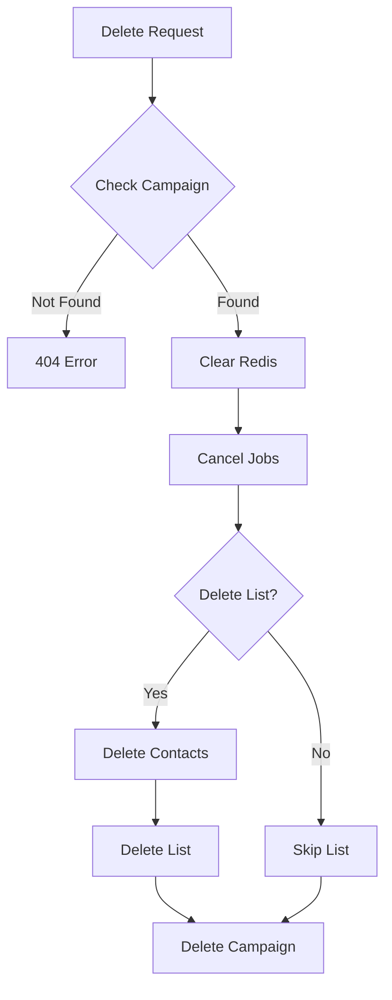

# Delete Campaign

Delete a campaign and optionally its associated contact list. This operation cannot be undone.

## Authentication

Include your API key in the request headers:

```bash
Authorization: Bearer YOUR_API_KEY
```

## Path Parameters

<ParamField path="campaign_id" type="string" required>
  The unique identifier of the campaign to delete
</ParamField>

## Query Parameters

<ParamField query="delete_contact_list" type="boolean" default="false">
  Whether to also delete the associated contact list
</ParamField>

### Example Request

```bash
# Delete campaign only
curl --request DELETE \
  --url https://api.kallabot.com/v1/campaign/camp_01H1V1J3K4M5N6P7Q8R9S0T1U2 \
  --header 'Authorization: Bearer YOUR_API_KEY'

# Delete campaign and contact list
curl --request DELETE \
  --url "https://api.kallabot.com/v1/campaign/camp_01H1V1J3K4M5N6P7Q8R9S0T1U2?delete_contact_list=true" \
  --header 'Authorization: Bearer YOUR_API_KEY'
```

## Response

<ResponseField name="status" type="string" required>
  The status of the operation (success)
</ResponseField>

<ResponseField name="message" type="string" required>
  A message describing the result of the operation
</ResponseField>

<ResponseField name="campaign_id" type="string" required>
  The ID of the deleted campaign
</ResponseField>

<ResponseField name="previous_status" type="string" required>
  The status of the campaign before deletion
</ResponseField>

<ResponseField name="contact_list_deleted" type="boolean" required>
  Whether the associated contact list was also deleted
</ResponseField>

### Example Response

```json
{
  "status": "success",
  "message": "Campaign deleted successfully",
  "campaign_id": "camp_01H1V1J3K4M5N6P7Q8R9S0T1U2",
  "previous_status": "completed",
  "contact_list_deleted": true
}
```

## Effects

When a campaign is deleted:
- Campaign record is removed from the database
- Redis flags are cleared
- Scheduled jobs are cancelled
- If `delete_contact_list=true`:
  - All contacts in the list are deleted
  - The contact list itself is deleted

## Data Cleanup



## Errors

| Status | Description |
|--------|-------------|
| 401    | Invalid or missing API key |
| 404    | Campaign not found |
| 500    | Failed to delete campaign |

## Warning

<Warning>
  This operation is irreversible. Once a campaign is deleted, it cannot be recovered. If `delete_contact_list` is set to true, all associated contacts will also be permanently deleted.
</Warning>

## Best Practices

1. Always confirm before deleting a campaign
2. Consider archiving campaigns instead of deleting them
3. Back up contact lists before deletion if they might be needed later
4. Use `delete_contact_list=true` only when you're certain the contact list won't be needed for other campaigns
