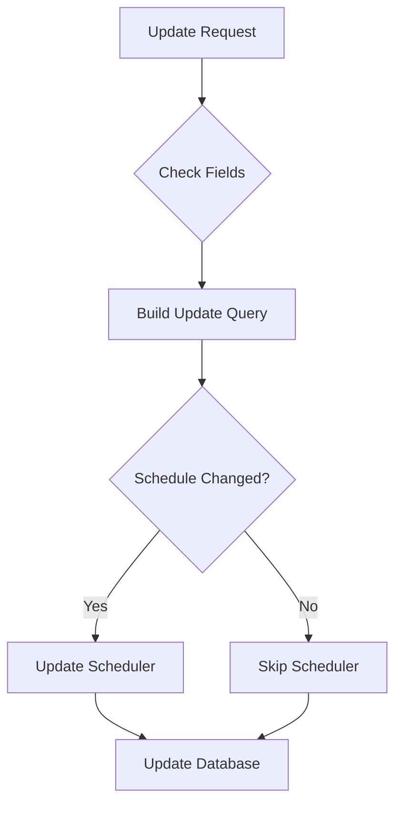

# Edit Campaign

Update the configuration of an existing campaign. All fields are optional, and only provided fields will be updated.

## Authentication

Include your API key in the request headers:

```bash
Authorization: Bearer YOUR_API_KEY
```

## Path Parameters

<ParamField path="campaign_id" type="string" required>
  The unique identifier of the campaign to update
</ParamField>

## Request Body

<ParamField body="agent_id" type="string">
  New agent ID to handle the campaign calls
</ParamField>

<ParamField body="list_id" type="string">
  New contact list ID for the campaign
</ParamField>

<ParamField body="name" type="string">
  New name for the campaign
</ParamField>

<ParamField body="description" type="string">
  New description for the campaign
</ParamField>

<ParamField body="sender_phone_number" type="string">
  New phone number to make calls from (E.164 format)
</ParamField>

<ParamField body="delay_between_calls" type="integer">
  New delay in seconds between consecutive calls
</ParamField>

<ParamField body="scheduled_time" type="string">
  New scheduled start time (ISO 8601 datetime format)
</ParamField>

<ParamField body="timezone" type="string">
  New timezone for the campaign (e.g., "America/New_York")
</ParamField>

<ParamField body="record" type="boolean">
  Whether to record calls in this campaign
</ParamField>

### Example Request

```bash
curl --request PATCH \
  --url https://api.kallabot.com/v1/campaign/camp_01H1V1J3K4M5N6P7Q8R9S0T1U2 \
  --header 'Authorization: Bearer YOUR_API_KEY' \
  --header 'Content-Type: application/json' \
  --data '{
    "name": "Updated Q1 Sales Campaign",
    "description": "Updated follow-up campaign",
    "delay_between_calls": 20,
    "scheduled_time": "2024-02-15T09:00:00",
    "timezone": "America/Chicago"
  }'
```

## Response

<ResponseField name="status" type="string" required>
  The status of the operation (success)
</ResponseField>

<ResponseField name="message" type="string" required>
  A message describing the result of the operation
</ResponseField>

<ResponseField name="campaign_id" type="string" required>
  The ID of the updated campaign
</ResponseField>

<ResponseField name="list_id" type="string" required>
  The ID of the campaign's contact list
</ResponseField>

<ResponseField name="previous_status" type="string" required>
  The status of the campaign before the update
</ResponseField>

### Example Response

```json
{
  "status": "success",
  "message": "Campaign updated successfully",
  "campaign_id": "camp_01H1V1J3K4M5N6P7Q8R9S0T1U2",
  "list_id": "list_01H1V1J3K4M5N6P7Q8R9S0T1U2",
  "previous_status": "pending"
}
```

## Effects

When a campaign is updated:
- Only provided fields are modified
- Status change timestamp is updated
- If scheduled time is changed:
  - Old scheduled job is cancelled
  - New job is scheduled for the updated time
- If contact list is changed:
  - New list is validated for contacts
  - Campaign is updated to use new list

## Field Updates



## Errors

| Status | Description |
|--------|-------------|
| 400    | New contact list is empty |
| 401    | Invalid or missing API key |
| 404    | Campaign not found |
| 500    | Failed to update campaign |

## Best Practices

1. Only include fields that need to be updated
2. Validate new contact lists before updating
3. Consider timezone implications when updating schedule
4. Back up important data before significant changes
5. Test updates with a small campaign first
