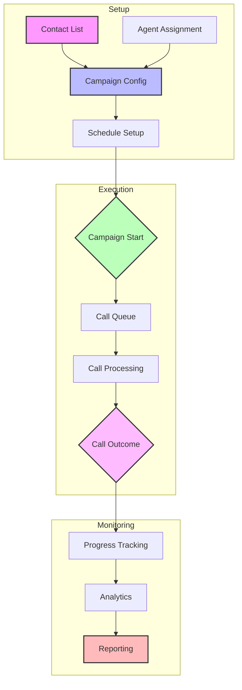

<Note>
  The Campaigns API enables you to orchestrate large-scale automated calling campaigns, managing schedules, monitoring progress, and analyzing results with detailed analytics.
</Note>

# Campaigns Overview

<Frame>
  

    

      Scale your voice communications with intelligent automation
    

    

      Kallabot's Campaigns API provides enterprise-grade campaign management with advanced scheduling, real-time monitoring, and comprehensive analytics for outbound calling operations.
    

  

</Frame>

## Key Features

<CardGroup cols={3}>
  <Card title="Smart Scheduling" icon="calendar">
    Intelligent time zone-aware scheduling
  </Card>
  <Card title="Progress Tracking" icon="chart-line">
    Real-time campaign monitoring
  </Card>
  <Card title="Contact Management" icon="address-book">
    Efficient contact list handling
  </Card>
  <Card title="Dynamic Control" icon="sliders">
    Pause, resume, and adjust campaigns
  </Card>
  <Card title="Performance Analytics" icon="chart-mixed">
    Comprehensive success metrics
  </Card>
  <Card title="Resource Optimization" icon="gauge">
    Automatic resource balancing
  </Card>
</CardGroup>

## Campaign Types

<Tabs>
  <Tab title="Outreach">
    

      <CardGroup cols={2}>
        <Card title="Sales Campaigns" icon="shopping-cart">
          Product and service promotion
          <Accordion title="Features">
            - Lead qualification
            - Product presentation
            - Follow-up scheduling
          </Accordion>
        </Card>
        <Card title="Survey Campaigns" icon="clipboard-question">
          Market research and feedback
          <Accordion title="Features">
            - Response collection
            - Data analysis
            - Sentiment tracking
          </Accordion>
        </Card>
      </CardGroup>
    

  </Tab>
  <Tab title="Notifications">
    

      <CardGroup cols={2}>
        <Card title="Appointment Reminders" icon="calendar-check">
          Schedule management
          <Accordion title="Features">
            - Confirmation calls
            - Rescheduling options
            - Follow-up reminders
          </Accordion>
        </Card>
        <Card title="Updates & Alerts" icon="bell">
          Information distribution
          <Accordion title="Features">
            - Status updates
            - Emergency alerts
            - Service notifications
          </Accordion>
        </Card>
      </CardGroup>
    

  </Tab>
</Tabs>

## Campaign Architecture

## Available Endpoints

<CardGroup cols={2}>
  <Card title="Create Campaign" icon="plus" href="/api-reference/campaigns/create">
    

      Set up new calling campaigns
      <Tabs>
        <Tab title="Method">POST /v1/campaign</Tab>
        <Tab title="Features">
          - Contact list upload
          - Schedule configuration
          - Agent assignment
        </Tab>
      </Tabs>
    

  </Card>
  <Card title="Get Campaign" icon="circle-info" href="/api-reference/campaigns/get">
    

      Retrieve campaign details
      <Tabs>
        <Tab title="Method">GET /v1/campaign/{"{campaign_id}"}</Tab>
        <Tab title="Features">
          - Progress tracking
          - Success metrics
          - Call statistics
        </Tab>
      </Tabs>
    

  </Card>
  <Card title="Pause Campaign" icon="pause" href="/api-reference/campaigns/pause">
    

      Temporarily halt campaigns
      <Tabs>
        <Tab title="Method">POST /v1/campaign/{"{campaign_id}"}/pause</Tab>
        <Tab title="Features">
          - Graceful pausing
          - Call preservation
          - Status updates
        </Tab>
      </Tabs>
    

  </Card>
  <Card title="Resume Campaign" icon="play" href="/api-reference/campaigns/resume">
    

      Restart paused campaigns
      <Tabs>
        <Tab title="Method">POST /v1/campaign/{"{campaign_id}"}/resume</Tab>
        <Tab title="Features">
          - Progress restoration
          - Schedule adjustment
          - Resource allocation
        </Tab>
      </Tabs>
    

  </Card>
</CardGroup>

## Campaign States

<Steps>
  <Step title="Created">
    Initial campaign setup complete
    <Accordion title="Details">
      - Configuration validation
      - Resource allocation
      - Schedule confirmation
    </Accordion>
  </Step>
  <Step title="Active">
    Campaign actively making calls
    <Accordion title="Details">
      - Call initiation
      - Progress tracking
      - Resource management
    </Accordion>
  </Step>
  <Step title="Paused">
    Campaign temporarily halted
    <Accordion title="Details">
      - Call preservation
      - State management
      - Resource release
    </Accordion>
  </Step>
  <Step title="Completed">
    Campaign finished processing
    <Accordion title="Details">
      - Results compilation
      - Analytics generation
      - Resource cleanup
    </Accordion>
  </Step>
</Steps>

## Configuration Options

<Tabs>
  <Tab title="Scheduling">
    <ParamField body="schedule_config" type="object">
      Campaign timing settings
      <Accordion title="Parameters">
        | Parameter | Description | Example |
        |-----------|-------------|---------|
        | start_time | Campaign start | 2024-01-15T09:00:00Z |
        | end_time | Campaign end | 2024-01-15T17:00:00Z |
        | timezone | Target timezone | America/New_York |
      </Accordion>
    </ParamField>
  </Tab>
  <Tab title="Contacts">
    <ParamField body="contact_config" type="object">
      Contact list settings
      <Accordion title="Options">
        - List validation
        - Number formatting
        - Duplicate handling
        - Priority assignment
      </Accordion>
    </ParamField>
  </Tab>
  <Tab title="Execution">
    <ParamField body="execution_params" type="object">
      Runtime configuration
      <Accordion title="Features">
        - Concurrent calls
        - Retry attempts
        - Timeout settings
        - Error handling
      </Accordion>
    </ParamField>
  </Tab>
</Tabs>

## Best Practices

<AccordionGroup>
  <Accordion title="Campaign Planning" icon="tasks">
    - Define clear objectives
    - Segment contact lists
    - Set realistic schedules
    - Plan resource allocation
    - Configure fallbacks
  </Accordion>

  <Accordion title="Contact Management" icon="address-card">
    - Validate phone numbers
    - Update contact status
    - Handle time zones
    - Manage preferences
    - Track engagement
  </Accordion>

  <Accordion title="Performance Optimization" icon="gauge">
    - Monitor success rates
    - Analyze call patterns
    - Adjust concurrency
    - Optimize scheduling
    - Balance resources
  </Accordion>

  <Accordion title="Compliance" icon="shield-check">
    - Follow regulations
    - Respect quiet hours
    - Handle opt-outs
    - Maintain records
    - Ensure consent
  </Accordion>
</AccordionGroup>

## Limits and Quotas

<CardGroup cols={3}>
  <Card title="Campaigns" icon="bullhorn">
    

      - Active: 10
      - Contacts: 100,000
      - Duration: 30 days
    

  </Card>
  <Card title="Execution" icon="play">
    

      - Concurrent calls: 50
      - Retry attempts: 3
      - Call interval: 1s
    

  </Card>
  <Card title="Storage" icon="database">
    

      - Contact lists: 1GB
      - Results: 90 days
      - Analytics: 12 months
    

  </Card>
</CardGroup>

## Error Handling

<ResponseField name="Common Errors" type="object">
  <Expandable title="Error Categories">
    <ResponseField name="configuration" type="object">
      Setup errors
      <Accordion title="Examples">
        - Invalid schedule
        - Bad contact data
        - Resource conflict
      </Accordion>
    </ResponseField>

    <ResponseField name="execution" type="object">
      Runtime errors
      <Accordion title="Examples">
        - Resource exhausted
        - Rate limited
        - System overload
      </Accordion>
    </ResponseField>

    <ResponseField name="compliance" type="object">
      Regulatory errors
      <Accordion title="Examples">
        - Quiet hours
        - Blocked numbers
        - Geographic restrictions
      </Accordion>
    </ResponseField>
  </Expandable>
</ResponseField>

## Related Resources

<CardGroup cols={2}>
  <Card title="Agents" icon="robot" href="/api-reference/agents/overview">
    AI agent configuration
  </Card>
  <Card title="Calls" icon="phone" href="/api-reference/calls/overview">
    Call management guide
  </Card>
  <Card title="Analytics" icon="chart-mixed" href="/api-reference/analytics/overview">
    Campaign analytics
  </Card>
  <Card title="Compliance" icon="gavel" href="/guides/compliance">
    Regulatory guidelines
  </Card>
</CardGroup>

## Support

<CardGroup cols={3}>
  <Card title="Documentation" icon="book">
    Comprehensive guides
  </Card>
  <Card title="API Status" icon="signal" href="https://status.kallabot.com">
    Real-time monitoring
  </Card>
  <Card title="Help Center" icon="headset" href="https://help.kallabot.com">
    24/7 technical support
  </Card>
</CardGroup> 