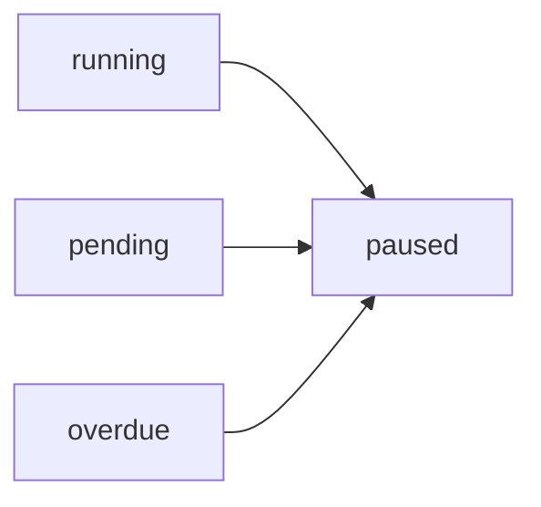

# Pause Campaign

Pause an active campaign. This will stop new calls from being initiated while allowing any active calls to complete naturally.

## Authentication

Include your API key in the request headers:

```bash
Authorization: Bearer YOUR_API_KEY
```

## Path Parameters

<ParamField path="campaign_id" type="string" required>
  The unique identifier of the campaign to pause
</ParamField>

### Example Request

```bash
curl --request POST \
  --url https://api.kallabot.com/v1/campaign/pause/camp_01H1V1J3K4M5N6P7Q8R9S0T1U2 \
  --header 'Authorization: Bearer YOUR_API_KEY'
```

## Response

<ResponseField name="status" type="string" required>
  The status of the operation (success)
</ResponseField>

<ResponseField name="message" type="string" required>
  A message describing the result of the operation
</ResponseField>

<ResponseField name="campaign_id" type="string" required>
  The ID of the paused campaign
</ResponseField>

### Example Response

```json
{
  "status": "success",
  "message": "Campaign paused successfully. Active calls will complete but no new calls will be initiated.",
  "campaign_id": "camp_01H1V1J3K4M5N6P7Q8R9S0T1U2"
}
```

## Effects

When a campaign is paused:
- Campaign status is updated to 'paused'
- A pause flag is set in Redis (expires after 24 hours)
- Any scheduled future execution is cancelled
- Active calls are allowed to complete
- No new calls will be initiated
- Campaign can be resumed later

## State Transitions



## Errors

| Status | Description |
|--------|-------------|
| 401    | Invalid or missing API key |
| 404    | Campaign not found |
| 500    | Failed to pause campaign |
