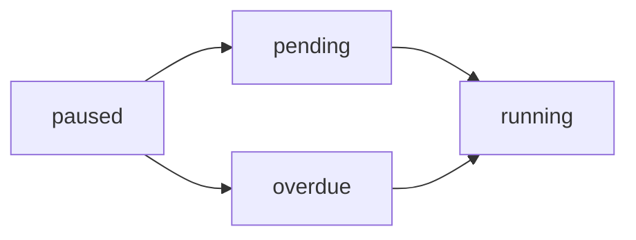
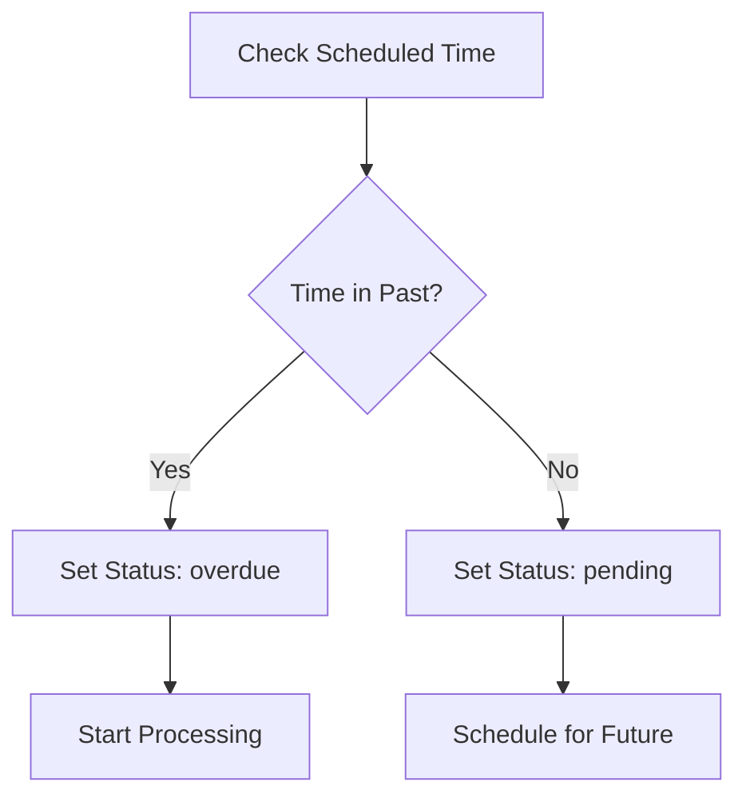

# Resume Campaign

Resume a paused campaign. The campaign will either start immediately if it's overdue or be scheduled for future execution based on its original scheduled time.

## Authentication

Include your API key in the request headers:

```bash
Authorization: Bearer YOUR_API_KEY
```

## Path Parameters

<ParamField path="campaign_id" type="string" required>
  The unique identifier of the campaign to resume
</ParamField>

### Example Request

```bash
curl --request POST \
  --url https://api.kallabot.com/v1/campaign/resume/camp_01H1V1J3K4M5N6P7Q8R9S0T1U2 \
  --header 'Authorization: Bearer YOUR_API_KEY'
```

## Response

<ResponseField name="status" type="string" required>
  The status of the operation (success)
</ResponseField>

<ResponseField name="message" type="string" required>
  A message describing the result of the operation, including the new campaign status
</ResponseField>

<ResponseField name="campaign_id" type="string" required>
  The ID of the resumed campaign
</ResponseField>

### Example Response

```json
{
  "status": "success",
  "message": "Campaign resumed successfully. New status: overdue",
  "campaign_id": "camp_01H1V1J3K4M5N6P7Q8R9S0T1U2"
}
```

## Effects

When a campaign is resumed:
- Pause flag is removed from Redis
- Campaign status is updated based on scheduled time:
  - If scheduled time is in the past: status becomes 'overdue' and processing starts immediately
  - If scheduled time is in the future: status becomes 'pending' and campaign is scheduled
- Campaign processing is either initiated or scheduled

## State Transitions



## Status Determination

The new status is determined by comparing the current time with the campaign's scheduled time:



## Errors

| Status | Description |
|--------|-------------|
| 400    | Campaign is not paused |
| 401    | Invalid or missing API key |
| 404    | Campaign not found |
| 500    | Failed to resume campaign |

## Notes

- Only campaigns in the 'paused' state can be resumed
- Resumed campaigns maintain their original scheduled time
- If a campaign is overdue, it will start processing immediately
- Future-dated campaigns will be scheduled for their original time
