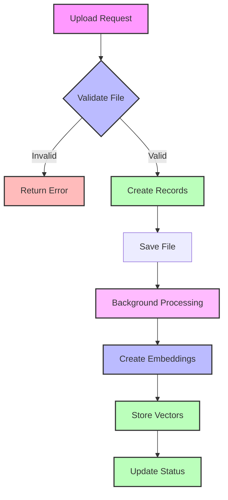

<Note>
  The Knowledgebase API enables Retrieval-Augmented Generation (RAG) capabilities for your AI voice agents, allowing them to access and utilize information from your PDF documents during conversations.
</Note>

# Create Knowledgebase

Create a new knowledgebase by uploading a PDF document. The system will process the document, create embeddings, and make the information available to your AI voice agents.

<Tabs>
  <Tab title="Overview">
    RAG capabilities include:
    - Automatic document processing
    - Vector embeddings creation
    - Semantic search functionality
    - Real-time information retrieval
  </Tab>
  <Tab title="Use Cases">
    Common applications:
    - Product documentation
    - Company policies
    - Technical specifications
    - Training materials
  </Tab>
  <Tab title="Requirements">
    Before creating a knowledgebase:
    - Prepare PDF documents
    - Ensure content quality
    - Plan information structure
    - Consider document size
  </Tab>
</Tabs>

## Authentication

Include your API key in the request headers:

```bash
Authorization: Bearer YOUR_API_KEY
```

## Request Body

This endpoint expects a multipart/form-data request with the following fields:

<ParamField body="friendly_name" type="string" required>
  A human-readable name for the knowledgebase
  <Frame>
    <div className="flex gap-2">
      ✅ "Product Manual 2024"
      ❌ "kb_123"
    </div>
  </Frame>
</ParamField>

<ParamField body="file" type="file" required>
  The PDF file to process
  <Accordion title="File Requirements">
    - Format: PDF only
    - Maximum size: 10MB
    - Text must be extractable
    - Supported languages: English, Spanish, French
  </Accordion>
</ParamField>

<ParamField body="config" type="object">
  Optional configuration for the knowledgebase processing
  
  <Expandable title="Configuration Options">
    <ParamField body="table" type="string" default="None">
      Custom table name for vector storage
    </ParamField>

    <ParamField body="chunk_size" type="integer" default="512">
      Size of text chunks for processing
      <Accordion title="Chunk Size Guidelines">
        | Size | Best For |
        |------|----------|
        | 256 | Short, precise responses |
        | 512 | Balanced context (recommended) |
        | 1024 | Detailed, comprehensive responses |
      </Accordion>
    </ParamField>

    <ParamField body="overlapping" type="integer" default="200">
      Number of overlapping tokens between chunks
      <Accordion title="Overlap Impact">
        - Maintains context between chunks
        - Improves response coherence
        - Affects processing time
        - Impacts storage size
      </Accordion>
    </ParamField>
  </Expandable>
</ParamField>

### Example Request

<CodeGroup>
  <CodeBlock title="cURL" icon="curl">
  ```bash
  curl --request POST \
    --url https://api.kallabot.com/v1/knowledgebase \
    --header 'Authorization: Bearer YOUR_API_KEY' \
    --header 'Content-Type: multipart/form-data' \
    --form 'friendly_name=Product Manual 2024' \
    --form 'file=@/path/to/document.pdf'
  ```
  </CodeBlock>

  <CodeBlock title="Python" icon="python">
  ```python
  import requests

  url = "https://api.kallabot.com/v1/knowledgebase"
  headers = {
      "Authorization": "Bearer YOUR_API_KEY"
  }
  
  files = {
      'file': ('document.pdf', open('document.pdf', 'rb'), 'application/pdf')
  }
  data = {
      'friendly_name': 'Product Manual 2024'
  }

  response = requests.post(url, headers=headers, files=files, data=data)
  print(response.json())
  ```
  </CodeBlock>

  <CodeBlock title="Node.js" icon="node">
  ```javascript
  const FormData = require('form-data');
  const fs = require('fs');
  const axios = require('axios');

  const form = new FormData();
  form.append('file', fs.createReadStream('document.pdf'));
  form.append('friendly_name', 'Product Manual 2024');

  axios.post('https://api.kallabot.com/v1/knowledgebase', form, {
    headers: {
      'Authorization': 'Bearer YOUR_API_KEY',
      ...form.getHeaders()
    }
  })
  .then(response => console.log(response.data))
  .catch(error => console.error(error));
  ```
  </CodeBlock>
</CodeGroup>

## Response

<ResponseField name="kb_id" type="string" required>
  Unique identifier for the created knowledgebase
</ResponseField>

<ResponseField name="vector_store_id" type="string" required>
  Identifier for the vector store containing embeddings
</ResponseField>

<ResponseField name="status" type="string" required>
  Current status of the knowledgebase processing
  <Accordion title="Status Values">
    | Status | Description |
    |--------|-------------|
    | processing | Document is being processed |
    | processed | Ready for use |
    | failed | Processing failed |
    | queued | Waiting for processing |
  </Accordion>
</ResponseField>

<ResponseField name="friendly_name" type="string" required>
  The provided friendly name for the knowledgebase
</ResponseField>

### Example Response

<CodeGroup>
  <CodeBlock title="Success">
  ```json
  {
    "kb_id": "kb_01H1V1J3K4M5N6P7Q8R9S0T1U2",
    "vector_store_id": "vec_01H1V1J3K4M5N6P7Q8R9S0T1U2",
    "status": "processed",
    "friendly_name": "Product Manual 2024"
  }
  ```
  </CodeBlock>

  <CodeBlock title="Error">
  ```json
  {
    "error": {
      "code": "invalid_file",
      "message": "Only PDF files are accepted",
      "details": {
        "content_type": "application/msword"
      }
    }
  }
  ```
  </CodeBlock>
</CodeGroup>

## Processing Flow



## RAG Process

<Steps>
  <Step title="Document Upload">
    PDF document is validated and temporarily stored
  </Step>
  <Step title="Text Extraction">
    Text is extracted and cleaned from the PDF
  </Step>
  <Step title="Chunking">
    Content is split into overlapping chunks for processing
  </Step>
  <Step title="Embedding Generation">
    Vector embeddings are created for each chunk
  </Step>
  <Step title="Vector Storage">
    Embeddings are stored for quick retrieval
  </Step>
  <Step title="Integration">
    Knowledgebase is made available to AI agents
  </Step>
</Steps>

## Errors

| Status | Description | Resolution |
|--------|-------------|------------|
| 400    | Invalid file type | Ensure file is PDF format |
| 400    | Duplicate name | Choose a unique friendly name |
| 401    | Invalid API key | Verify API credentials |
| 413    | File too large | Reduce file size or split document |
| 429    | Rate limit exceeded | Implement backoff strategy |
| 500    | Processing failed | Contact support with error details |

## Best Practices

<CardGroup cols={2}>
  <Card title="Document Quality" icon="file-pdf">
    Ensure PDFs have extractable text
  </Card>
  <Card title="Content Structure" icon="sitemap">
    Organize information logically
  </Card>
  <Card title="Chunk Size" icon="puzzle-piece">
    Balance between context and precision
  </Card>
  <Card title="Monitoring" icon="gauge">
    Track processing status
  </Card>
  <Card title="Testing" icon="vial">
    Verify retrieval quality
  </Card>
  <Card title="Updates" icon="arrows-rotate">
    Keep content current
  </Card>
</CardGroup>

## Related Resources

<CardGroup cols={2}>
  <Card title="RAG Overview" icon="brain" href="/guides/rag">
    Learn about RAG technology
  </Card>
  <Card title="Agent Integration" icon="robot" href="/guides/kb-integration">
    Connect agents to knowledgebases
  </Card>
  <Card title="Best Practices" icon="star" href="/guides/kb-best-practices">
    Optimize your knowledgebases
  </Card>
  <Card title="Troubleshooting" icon="wrench" href="/guides/kb-troubleshooting">
    Common issues and solutions
  </Card>
</CardGroup>
