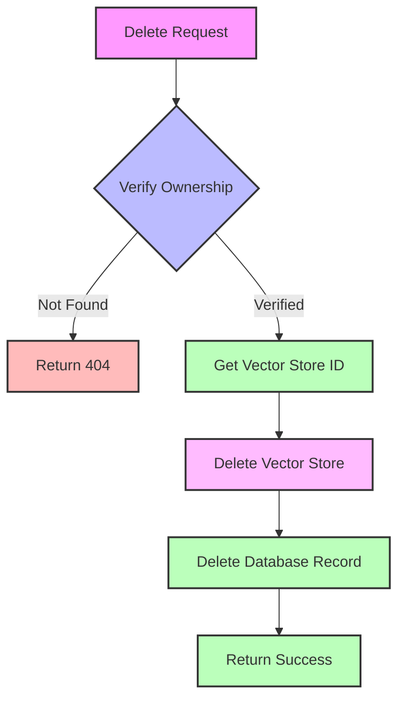

<Warning>
  This operation permanently deletes a knowledgebase and its associated vector store. This action cannot be undone.
</Warning>

# Delete Knowledgebase

Permanently remove a knowledgebase and all its associated resources, including vector embeddings and stored files.

<Tabs>
  <Tab title="Overview">
    Deletion process includes:
    - Database record removal
    - Vector store cleanup
    - File system cleanup
    - Resource deallocation
  </Tab>
  <Tab title="Use Cases">
    Common reasons for deletion:
    - Outdated content
    - Resource optimization
    - Data cleanup
    - Content updates
  </Tab>
  <Tab title="Prerequisites">
    Before deletion:
    - Verify knowledgebase ID
    - Check dependencies
    - Backup if needed
    - Notify users
  </Tab>
</Tabs>

## Authentication

Include your API key in the request headers:

```bash
Authorization: Bearer YOUR_API_KEY
```

## Path Parameters

<ParamField path="kb_id" type="string" required>
  The unique identifier of the knowledgebase to delete
  <Frame>
    Example: kb_01H1V1J3K4M5N6P7Q8R9S0T1U2
  </Frame>
</ParamField>

### Example Request

<CodeGroup>
  <CodeBlock title="cURL" icon="curl">
  ```bash
  curl --request DELETE \
    --url https://api.kallabot.com/v1/knowledgebase/kb_01H1V1J3K4M5N6P7Q8R9S0T1U2 \
    --header 'Authorization: Bearer YOUR_API_KEY'
  ```
  </CodeBlock>

  <CodeBlock title="Python" icon="python">
  ```python
  import requests

  kb_id = "kb_01H1V1J3K4M5N6P7Q8R9S0T1U2"
  url = f"https://api.kallabot.com/v1/knowledgebase/{kb_id}"
  headers = {
      "Authorization": "Bearer YOUR_API_KEY"
  }

  response = requests.delete(url, headers=headers)
  print(response.json())
  ```
  </CodeBlock>

  <CodeBlock title="Node.js" icon="node">
  ```javascript
  const axios = require('axios');

  const kb_id = 'kb_01H1V1J3K4M5N6P7Q8R9S0T1U2';
  
  axios.delete(`https://api.kallabot.com/v1/knowledgebase/${kb_id}`, {
    headers: {
      'Authorization': 'Bearer YOUR_API_KEY'
    }
  })
  .then(response => console.log(response.data))
  .catch(error => console.error(error));
  ```
  </CodeBlock>
</CodeGroup>

## Response

<ResponseField name="status" type="string" required>
  Operation status (always "success" for successful deletion)
</ResponseField>

<ResponseField name="message" type="string" required>
  Human-readable confirmation message
</ResponseField>

<ResponseField name="kb_id" type="string" required>
  The ID of the deleted knowledgebase
</ResponseField>

### Example Response

<CodeGroup>
  <CodeBlock title="Success">
  ```json
  {
    "status": "success",
    "message": "Knowledge base deleted successfully",
    "kb_id": "kb_01H1V1J3K4M5N6P7Q8R9S0T1U2"
  }
  ```
  </CodeBlock>

  <CodeBlock title="Not Found">
  ```json
  {
    "error": {
      "code": "not_found",
      "message": "Knowledge base not found or doesn't belong to the account"
    }
  }
  ```
  </CodeBlock>
</CodeGroup>

## Deletion Process



## Resource Cleanup

<Steps>
  <Step title="Ownership Verification">
    Check if knowledgebase belongs to the authenticated account
  </Step>
  <Step title="Vector Store Cleanup">
    Remove vector embeddings and associated files
  </Step>
  <Step title="Database Cleanup">
    Delete knowledgebase record from database
  </Step>
  <Step title="Resource Deallocation">
    Free up system resources and storage
  </Step>
</Steps>

## Error Handling

| Status | Description | Resolution |
|--------|-------------|------------|
| 400    | Invalid KB ID format | Check ID format |
| 401    | Invalid API key | Verify API credentials |
| 403    | Insufficient permissions | Check account access level |
| 404    | KB not found | Verify KB ID and ownership |
| 429    | Rate limit exceeded | Implement backoff strategy |
| 500    | Server error | Contact support with error details |

## Best Practices

<CardGroup cols={2}>
  <Card title="Verification" icon="check">
    Double-check KB ID before deletion
  </Card>
  <Card title="Backup" icon="database">
    Backup important data before deletion
  </Card>
  <Card title="Dependencies" icon="diagram-project">
    Check for dependent systems
  </Card>
  <Card title="Timing" icon="clock">
    Delete during low-traffic periods
  </Card>
</CardGroup>

## Safety Checklist

<AccordionGroup>
  <Accordion title="Before Deletion">
    - Verify correct knowledgebase ID
    - Check for active agent dependencies
    - Create backup if needed
    - Notify relevant team members
  </Accordion>

  <Accordion title="After Deletion">
    - Verify deletion success
    - Update dependent systems
    - Remove references in applications
    - Document the deletion
  </Accordion>

  <Accordion title="Common Pitfalls">
    - Deleting wrong knowledgebase
    - Ignoring dependencies
    - Missing backup creation
    - Incomplete cleanup
  </Accordion>
</AccordionGroup>

## Related Resources

<CardGroup cols={2}>
  <Card title="List Knowledgebases" icon="list" href="/api-reference/knowledgebases/list">
    View available knowledgebases
  </Card>
  <Card title="Create Knowledgebase" icon="plus" href="/api-reference/knowledgebases/create">
    Add new knowledgebases
  </Card>
  <Card title="Get Knowledgebase" icon="magnifying-glass" href="/api-reference/knowledgebases/get">
    View details before deletion
  </Card>
  <Card title="Best Practices" icon="book" href="/guides/kb-management">
    Knowledgebase management guide
  </Card>
</CardGroup>
