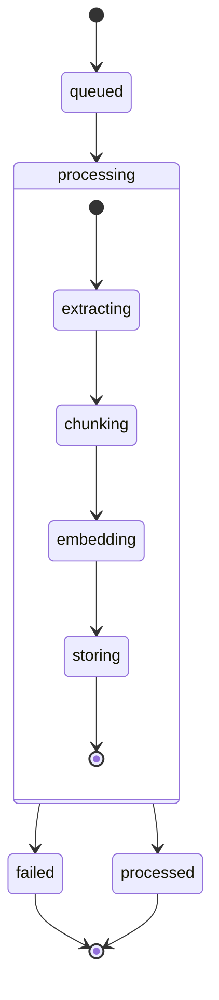

<Note>
  This endpoint returns a list of all knowledgebases associated with your account, ordered by creation date. Use this to monitor your RAG-enabled resources and their current status.
</Note>

# List Knowledgebases

Retrieve a paginated list of all knowledgebases in your account, including their status and configuration details.

<Tabs>
  <Tab title="Overview">
    List endpoint features:
    - Chronological ordering
    - Status monitoring
    - Resource management
    - Quick access to IDs
  </Tab>
  <Tab title="Use Cases">
    Common applications:
    - Resource monitoring
    - Status checking
    - Integration verification
    - Maintenance tasks
  </Tab>
  <Tab title="Response Types">
    Available information:
    - Basic details
    - Processing status
    - Creation timestamps
    - Vector store IDs
  </Tab>
</Tabs>

## Authentication

Include your API key in the request headers:

```bash
Authorization: Bearer YOUR_API_KEY
```

## Request Parameters

This endpoint accepts no query parameters. It returns all knowledgebases associated with the authenticated account.

### Example Request

<CodeGroup>
  <CodeBlock title="cURL" icon="curl">
  ```bash
  curl --request GET \
    --url https://api.kallabot.com/v1/knowledgebases \
    --header 'Authorization: Bearer YOUR_API_KEY'
  ```
  </CodeBlock>

  <CodeBlock title="Python" icon="python">
  ```python
  import requests

  url = "https://api.kallabot.com/v1/knowledgebases"
  headers = {
      "Authorization": "Bearer YOUR_API_KEY"
  }

  response = requests.get(url, headers=headers)
  print(response.json())
  ```
  </CodeBlock>

  <CodeBlock title="Node.js" icon="node">
  ```javascript
  const axios = require('axios');

  axios.get('https://api.kallabot.com/v1/knowledgebases', {
    headers: {
      'Authorization': 'Bearer YOUR_API_KEY'
    }
  })
  .then(response => console.log(response.data))
  .catch(error => console.error(error));
  ```
  </CodeBlock>
</CodeGroup>

## Response

<ResponseField name="knowledgebases" type="array" required>
  Array of knowledgebase objects
  <Expandable title="Knowledgebase Object">
    <ResponseField name="kb_id" type="string" required>
      Unique identifier for the knowledgebase
    </ResponseField>

    <ResponseField name="friendly_name" type="string" required>
      Human-readable name of the knowledgebase
    </ResponseField>

    <ResponseField name="vector_store_id" type="string" required>
      Identifier for the associated vector store
    </ResponseField>

    <ResponseField name="status" type="string" required>
      Current processing status
      <Accordion title="Status Values">
        | Status | Description |
        |--------|-------------|
        | processing | Document is being processed |
        | processed | Ready for use |
        | failed | Processing failed |
        | queued | Waiting for processing |
      </Accordion>
    </ResponseField>

    <ResponseField name="created_at" type="string" required>
      ISO 8601 formatted creation timestamp
    </ResponseField>
  </Expandable>
</ResponseField>

### Example Response

<CodeGroup>
  <CodeBlock title="Success">
  ```json
  {
    "knowledgebases": [
      {
        "kb_id": "kb_01H1V1J3K4M5N6P7Q8R9S0T1U2",
        "friendly_name": "Product Manual 2024",
        "vector_store_id": "vec_01H1V1J3K4M5N6P7Q8R9S0T1U2",
        "status": "processed",
        "created_at": "2024-01-15T08:30:00Z"
      },
      {
        "kb_id": "kb_02H1V1J3K4M5N6P7Q8R9S0T1U3",
        "friendly_name": "Company Policies",
        "vector_store_id": "vec_02H1V1J3K4M5N6P7Q8R9S0T1U3",
        "status": "processing",
        "created_at": "2024-01-14T15:45:00Z"
      }
    ]
  }
  ```
  </CodeBlock>

  <CodeBlock title="Empty">
  ```json
  {
    "knowledgebases": []
  }
  ```
  </CodeBlock>
</CodeGroup>

## Status Flow



## Monitoring Best Practices

<CardGroup cols={2}>
  <Card title="Regular Checks" icon="clock">
    Monitor processing status periodically
  </Card>
  <Card title="Status Tracking" icon="chart-line">
    Track failed processings for troubleshooting
  </Card>
  <Card title="Resource Usage" icon="gauge">
    Monitor number of active knowledgebases
  </Card>
  <Card title="Maintenance" icon="broom">
    Clean up unused knowledgebases
  </Card>
</CardGroup>

## Error Handling

| Status | Description | Resolution |
|--------|-------------|------------|
| 401    | Invalid API key | Verify API credentials |
| 403    | Insufficient permissions | Check account access level |
| 429    | Rate limit exceeded | Implement backoff strategy |
| 500    | Server error | Contact support with error details |

## Tips and Tricks

<AccordionGroup>
  <Accordion title="Efficient Monitoring">
    - Set up automated status checks
    - Monitor processing times
    - Track success rates
    - Set up alerts for failures
  </Accordion>

  <Accordion title="Resource Management">
    - Review unused knowledgebases
    - Archive old versions
    - Monitor storage usage
    - Track API usage
  </Accordion>

  <Accordion title="Performance Optimization">
    - Batch status checks
    - Cache responses
    - Implement retry logic
    - Use webhooks for updates
  </Accordion>
</AccordionGroup>

## Related Resources

<CardGroup cols={2}>
  <Card title="Create Knowledgebase" icon="plus" href="/api-reference/knowledgebases/create">
    Add new knowledgebases
  </Card>
  <Card title="Delete Knowledgebase" icon="trash" href="/api-reference/knowledgebases/delete">
    Remove unused knowledgebases
  </Card>
  <Card title="Update Knowledgebase" icon="pen" href="/api-reference/knowledgebases/update">
    Modify existing knowledgebases
  </Card>
  <Card title="Get Knowledgebase" icon="magnifying-glass" href="/api-reference/knowledgebases/get">
    View detailed information
  </Card>
</CardGroup>
