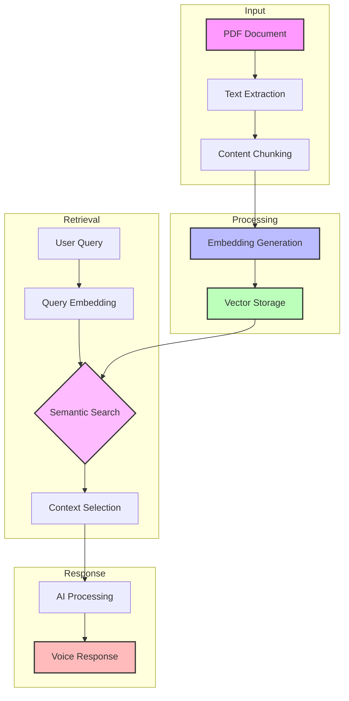

<Note>
  The Knowledgebase API enables AI voice agents to access and leverage information from your documents through advanced RAG technology, providing contextually relevant responses during conversations.
</Note>

# Knowledgebase Overview

<Frame>
  

    

      Transform your documents into intelligent conversational knowledge
    

    

      Kallabot's Knowledgebase API combines the power of vector embeddings, semantic search, and large language models to enable AI voice agents to understand and utilize your documentation effectively.
    

  

</Frame>

## Key Features

<CardGroup cols={3}>
  <Card title="Document Processing" icon="file-import">
    Automatic PDF processing with text extraction and cleaning
  </Card>
  <Card title="Vector Embeddings" icon="network-wired">
    Advanced embedding generation for semantic understanding
  </Card>
  <Card title="Real-time Retrieval" icon="bolt">
    Fast and accurate information access during calls
  </Card>
  <Card title="Contextual Integration" icon="brain-circuit">
    Seamless integration with AI conversation flow
  </Card>
  <Card title="Resource Management" icon="database">
    Efficient storage and organization of knowledge
  </Card>
  <Card title="Access Control" icon="lock">
    Secure and controlled information access
  </Card>
</CardGroup>

## How It Works

<Steps>
  <Step title="Document Upload">
    Upload PDF documents through the API
    <Accordion title="Supported Features">
      - PDF format support
      - Text extraction
      - Document validation
      - Size optimization
    </Accordion>
  </Step>
  <Step title="Processing Pipeline">
    Automatic document processing and embedding generation
    <Accordion title="Processing Steps">
      - Text cleaning
      - Content chunking
      - Metadata extraction
      - Quality validation
    </Accordion>
  </Step>
  <Step title="Vector Storage">
    Efficient storage and indexing of embeddings
    <Accordion title="Storage Features">
      - Vector database integration
      - Fast retrieval
      - Scalable architecture
      - Backup management
    </Accordion>
  </Step>
  <Step title="Integration">
    Seamless connection with AI voice agents
    <Accordion title="Integration Benefits">
      - Real-time access
      - Context preservation
      - Natural responses
      - Accuracy optimization
    </Accordion>
  </Step>
</Steps>

## RAG Architecture

## Available Endpoints

<CardGroup cols={2}>
  <Card title="Create Knowledgebase" icon="plus" href="/api-reference/knowledgebases/create">
    

      Upload and process new documents for RAG capabilities
      <Tabs>
        <Tab title="Method">POST /v1/knowledgebase</Tab>
        <Tab title="Features">
          - PDF processing
          - Vector generation
          - Metadata handling
        </Tab>
      </Tabs>
    

  </Card>
  <Card title="List Knowledgebases" icon="list" href="/api-reference/knowledgebases/list">
    

      Retrieve all available knowledgebases
      <Tabs>
        <Tab title="Method">GET /v1/knowledgebases</Tab>
        <Tab title="Features">
          - Status monitoring
          - Resource tracking
          - Creation timestamps
        </Tab>
      </Tabs>
    

  </Card>
  <Card title="Delete Knowledgebase" icon="trash" href="/api-reference/knowledgebases/delete">
    

      Remove knowledgebases and associated resources
      <Tabs>
        <Tab title="Method">DELETE /v1/knowledgebase/{"{kb_id}"}</Tab>
        <Tab title="Features">
          - Resource cleanup
          - Vector store removal
          - Safe deletion
        </Tab>
      </Tabs>
    

  </Card>
  <Card title="Get Knowledgebase" icon="magnifying-glass" href="/api-reference/knowledgebases/get">
    

      Retrieve detailed information about a specific knowledgebase
      <Tabs>
        <Tab title="Method">GET /v1/knowledgebase/{"{kb_id}"}</Tab>
        <Tab title="Features">
          - Status details
          - Usage statistics
          - Configuration info
        </Tab>
      </Tabs>
    

  </Card>
</CardGroup>

## Configuration Options

<Tabs>
  <Tab title="Processing">
    <ParamField body="chunk_size" type="integer" default="512">
      Size of text chunks for processing
      <Accordion title="Impact">
        | Size | Use Case | Trade-off |
        |------|----------|-----------|
        | 256 | Quick responses | Less context |
        | 512 | Balanced | Recommended |
        | 1024 | Detailed | Slower retrieval |
      </Accordion>
    </ParamField>
  </Tab>
  <Tab title="Storage">
    <ParamField body="vector_store" type="string" default="lance">
      Vector storage configuration
      <Accordion title="Options">
        - Lance: Fast local storage
        - PostgreSQL: Managed storage
        - Redis: Cache-optimized
      </Accordion>
    </ParamField>
  </Tab>
  <Tab title="Retrieval">
    <ParamField body="search_params" type="object">
      Retrieval configuration
      <Accordion title="Parameters">
        - Top K results
        - Similarity threshold
        - Context window
        - Response format
      </Accordion>
    </ParamField>
  </Tab>
</Tabs>

## Best Practices

<AccordionGroup>
  <Accordion title="Document Preparation" icon="file-lines">
    - Use clear, well-formatted PDFs
    - Ensure text is extractable
    - Optimize document size
    - Structure content logically
    - Include relevant metadata
  </Accordion>

  <Accordion title="Resource Management" icon="server">
    - Monitor storage usage
    - Clean up unused resources
    - Implement backup strategy
    - Track API usage
    - Set up alerts
  </Accordion>

  <Accordion title="Performance Optimization" icon="gauge">
    - Choose appropriate chunk sizes
    - Optimize vector storage
    - Cache frequent queries
    - Monitor response times
    - Balance accuracy vs speed
  </Accordion>

  <Accordion title="Integration Tips" icon="puzzle-piece">
    - Test with sample queries
    - Validate responses
    - Monitor agent performance
    - Collect user feedback
    - Iterate and improve
  </Accordion>
</AccordionGroup>

## Limits and Quotas

<CardGroup cols={3}>
  <Card title="Storage" icon="database">
    

      - Max file size: 10MB
      - Total storage: 100GB
      - Max documents: 1000
    

  </Card>
  <Card title="Processing" icon="gears">
    

      - Concurrent jobs: 10
      - Processing time: 5min
      - Retry attempts: 3
    

  </Card>
  <Card title="Retrieval" icon="bolt">
    

      - Requests/min: 100
      - Max results: 50
      - Context limit: 4K
    

  </Card>
</CardGroup>

## Error Handling

<ResponseField name="Common Errors" type="object">
  <Expandable title="Error Categories">
    <ResponseField name="validation" type="object">
      Input validation errors
      <Accordion title="Examples">
        - Invalid file format
        - Size exceeded
        - Missing fields
      </Accordion>
    </ResponseField>

    <ResponseField name="processing" type="object">
      Document processing errors
      <Accordion title="Examples">
        - Extraction failed
        - Embedding error
        - Storage full
      </Accordion>
    </ResponseField>

    <ResponseField name="retrieval" type="object">
      Data retrieval errors
      <Accordion title="Examples">
        - Not found
        - Access denied
        - Rate limited
      </Accordion>
    </ResponseField>
  </Expandable>
</ResponseField>

## Related Resources

<CardGroup cols={2}>
  <Card title="API Guides" icon="book" href="/guides/api">
    Detailed API usage guides and tutorials
  </Card>
  <Card title="RAG Documentation" icon="brain" href="/guides/rag">
    In-depth RAG technology explanation
  </Card>
  <Card title="Integration Examples" icon="code" href="/guides/examples">
    Code samples and integration patterns
  </Card>
  <Card title="Troubleshooting" icon="wrench" href="/guides/troubleshooting">
    Common issues and solutions
  </Card>
</CardGroup>

## Support

<CardGroup cols={3}>
  <Card title="Documentation" icon="book">
    Comprehensive guides and references
  </Card>
  <Card title="API Status" icon="signal" href="https://status.kallabot.com">
    Real-time API status monitoring
  </Card>
  <Card title="Help Center" icon="headset" href="https://help.kallabot.com">
    24/7 technical support
  </Card>
</CardGroup>
