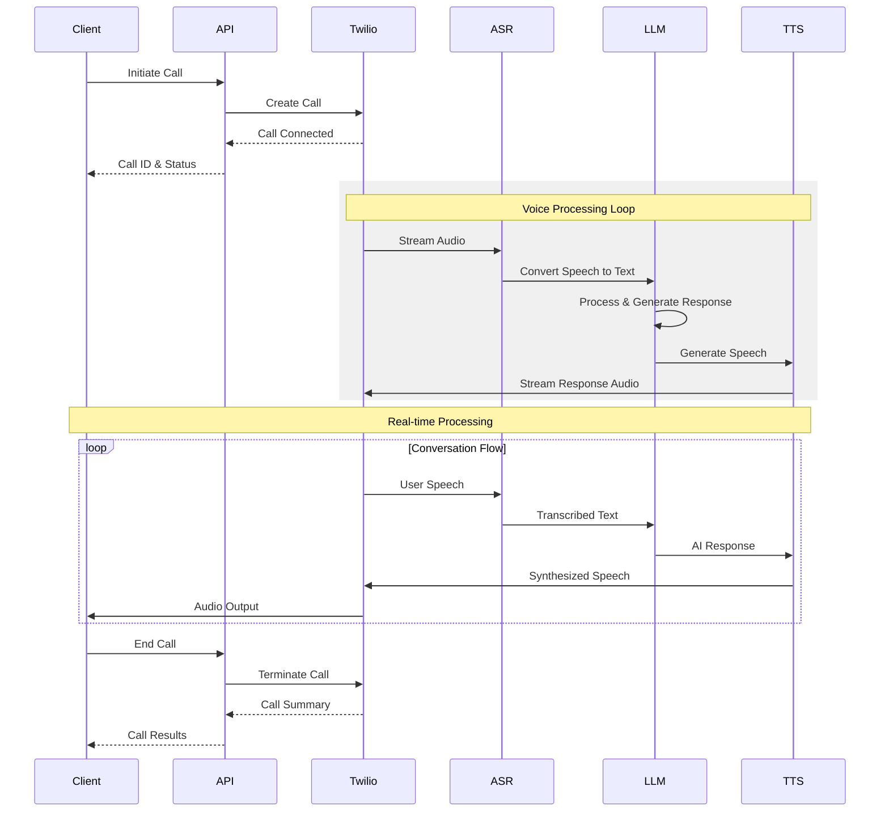

# Understanding AI Voice Agents

AI voice agents are intelligent software systems that can conduct natural conversations over the phone. They combine several cutting-edge technologies to understand, process, and respond to human speech in real-time.

## How AI Voice Agents Work

## Key Components Explained

<CardGroup cols={2}>
  <Card title="Speech Recognition (ASR)" icon="waveform">
    Converts incoming audio into text using advanced speech recognition models. Handles different accents, background noise, and speech patterns.
  </Card>
  
  <Card title="Natural Language Understanding" icon="brain">
    Analyzes the text to understand:
    - User intent
    - Key information
    - Sentiment
    - Context clues
  </Card>
  
  <Card title="Context Management" icon="database">
    Maintains the conversation state by:
    - Tracking discussion history
    - Managing variables
    - Following conversation flow
    - Handling multi-turn dialogues
  </Card>
  
  <Card title="Response Generation" icon="message">
    Creates appropriate responses using:
    - Large Language Models
    - Business logic
    - Conversation history
    - Knowledge base information
  </Card>
</CardGroup>

## Voice Processing Pipeline

<Steps>
  <Step title="Audio Input">
    Raw audio is captured and preprocessed for optimal quality
  </Step>
  
  <Step title="Speech Recognition">
    Audio is converted to text using ASR models
  </Step>
  
  <Step title="Intent Analysis">
    System determines what the user wants to accomplish
  </Step>
  
  <Step title="Context Processing">
    Current request is analyzed within conversation history
  </Step>
  
  <Step title="Knowledge Retrieval">
    Relevant information is pulled from connected sources
  </Step>
  
  <Step title="Response Formation">
    AI generates appropriate response using all available context
  </Step>
  
  <Step title="Voice Synthesis">
    Text response is converted to natural-sounding speech
  </Step>
</Steps>

## Types of Voice Agents

<Tabs>
  <Tab title="Customer Service">
    

      Handles support inquiries and customer assistance:
      - Product information
      - Account management
      - Technical support
      - FAQ responses
    

  </Tab>
  
  <Tab title="Sales">
    

      Manages sales-related conversations:
      - Product recommendations
      - Pricing inquiries
      - Order processing
      - Upselling opportunities
    

  </Tab>
  
  <Tab title="Appointments">
    

      Handles scheduling and calendar management:
      - Booking appointments
      - Rescheduling
      - Cancellations
      - Reminders
    

  </Tab>
</Tabs>

## Key Technologies

<AccordionGroup>
  <Accordion title="Large Language Models (LLMs)">
    Power the natural language understanding and generation capabilities, enabling human-like conversations and context awareness.
  </Accordion>
  
  <Accordion title="Neural Speech Recognition">
    Advanced models that convert speech to text with high accuracy across different accents and speaking styles.
  </Accordion>
  
  <Accordion title="Neural Text-to-Speech">
    Modern voice synthesis technology that creates natural-sounding speech with proper intonation and emphasis.
  </Accordion>
  
  <Accordion title="Vector Databases">
    Store and retrieve knowledge embeddings for contextual information access during conversations.
  </Accordion>
</AccordionGroup>

